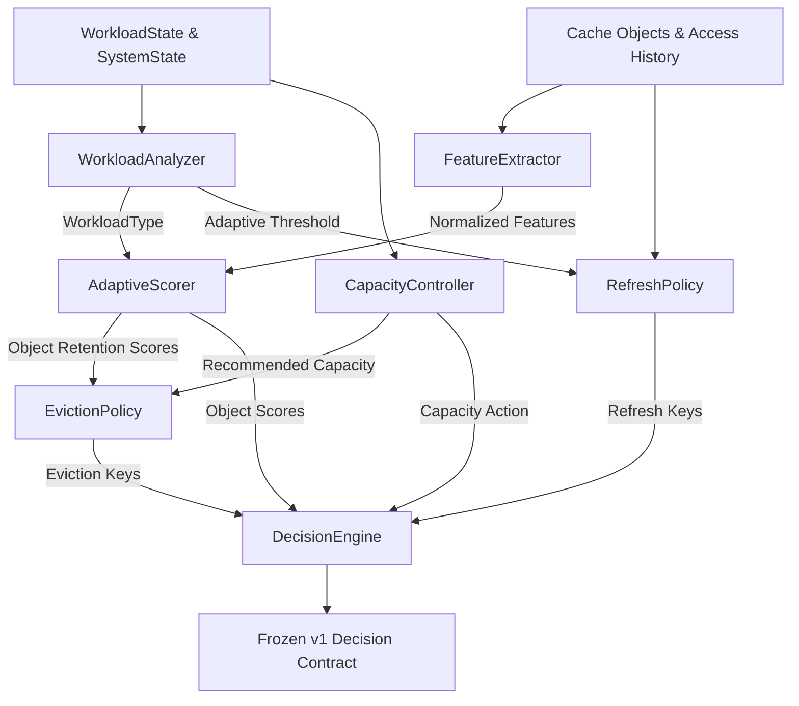

# Adaptive Cache System — Terminal Demonstration

This directory contains the standalone CLI demonstration of **Person 1's Adaptive Cache Intelligence** work completed across Steps 1 through 12.

---

## 1. Purpose of the Demo

The purpose of this demonstration is to provide an interactive, visible, and empirical verification of how Person 1's adaptive intelligence operates end-to-end:
- **Telemetry ingestion & classification**: Evaluates real-time request rates, hit/miss ratios, and latencies.
- **Multi-factor feature extraction**: Analyzes frequency, recency, backend retrieval cost, size, and popularity trends.
- **Utility-driven retention scoring**: Assigns normalized $[0.0, 1.0]$ scores based on workload context.
- **Staleness detection**: Evaluates refresh eligibility using adaptive staleness thresholds.
- **Logical capacity control**: Recommends `SCALE_UP`, `SCALE_DOWN`, or `MAINTAIN` actions.
- **Eviction selection**: Frees necessary capacity by evicting lowest-scoring items.
- **Policy benchmarking**: Replays identical synthetic workloads against `LRU`, `LFU`, `GDS`, and `ADAPTIVE` using Step 12's `BenchmarkRunner`.

---

## 2. Person 1 Implementation Scope

Person 1 implemented the complete adaptive intelligence pipeline:
- **Step 1 & 2**: Shared contracts and schemas (`CacheObject`, `WorkloadState`, `SystemState`, `Decision`).
- **Step 3**: `FeatureExtractor` extracting 5 normalized dimensions.
- **Step 4**: Baseline reference policies (`LRUPolicy`, `LFUPolicy`, `GDSPolicy`).
- **Step 5**: `WorkloadAnalyzer` classifying workload patterns (`STEADY`, `SPIKE`, `POPULARITY_SHIFT`, `READ_HEAVY`, `COMPUTE_HEAVY`).
- **Step 6**: `AdaptiveScorer` computing weighted utility scores.
- **Step 7**: `EvictionPolicy` performing deterministic capacity-driven candidate eviction.
- **Step 8**: `CostModel` evaluating backend regeneration savings vs memory expense.
- **Step 9**: `CapacityController` managing logical cache resizing recommendations.
- **Step 9.5**: `RefreshPolicy` detecting data staleness.
- **Step 10**: `DecisionEngine` unifying all components into frozen `Decision` contracts.
- **Step 11**: Synthetic workload generator and scenarios.
- **Step 12**: Policy-agnostic benchmark runner and metrics model.

---

## 3. Architecture Flow



---

## 4. How to Run

From the repository root:

```bash
# Standard interactive execution
python -m demo.adaptive_demo

# Custom seed and request count
python -m demo.adaptive_demo --seed 42 --requests 100

# Automated execution (quiet mode)
python -m demo.adaptive_demo --quiet
```

---

## 5. Demonstration Sections Explained

| Section | Content & Meaning |
|---|---|
| **Section 1: System Overview** | Outlines the architecture boundary (100% pure Python, zero infrastructure dependencies, offline execution) and lists the core components. |
| **Section 2: Scenario Selection** | Presents the configuration matrix of 6 synthetic benchmark scenarios across `product_catalog` (read-heavy, low backend latency) and `recommendations` (compute-heavy, high backend latency) profiles. |
| **Section 3: Walkthrough** | Live step-by-step trace of a cache state under capacity pressure. Shows real outputs from `FeatureExtractor`, `WorkloadAnalyzer`, `AdaptiveScorer`, `RefreshPolicy`, `CapacityController`, `EvictionPolicy`, and the final `DecisionEngine` contract. |
| **Section 4: Scenario Reaction** | Compares decisions across 3 distinct operational conditions (Steady State, Traffic Spike, Low Load). Demonstrates how capacity sizing and refresh thresholds dynamically adapt to telemetry. |
| **Section 5: Policy Benchmark** | Executes Step 12's `BenchmarkRunner` on all 6 scenarios, comparing `LRU`, `LFU`, `GDS`, and `ADAPTIVE` side-by-side on hit ratio, P99 latency, backend requests prevented, evictions, and memory usage. |
| **Section 6: Final Summary** | Objective, data-driven synthesis of policy strengths and trade-offs based purely on empirical benchmark findings. |

---

## 6. Fairness & Determinism Guarantees

> [!IMPORTANT]
> **Identical Workload Replay**: Every benchmarked policy receives the exact same ordered `ScenarioEvent` sequence. No policy generates its own random numbers, and event lists are never mutated.

> [!NOTE]
> **Isolated State**: Each policy executes inside an independent in-memory `CacheSimulator` instance with an initially empty cache. No policy state contaminates another.

> [!TIP]
> **Dynamically Generated Results**: All metrics and decisions displayed in this demo are computed live by the real components during execution. Nothing is hardcoded or mocked.
