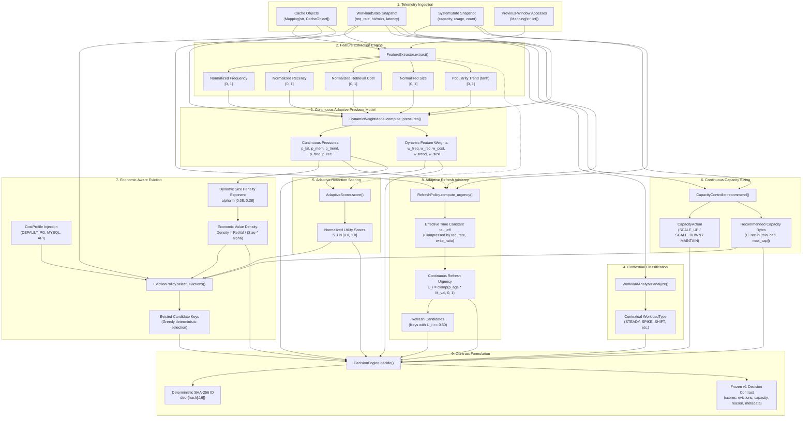
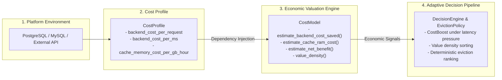
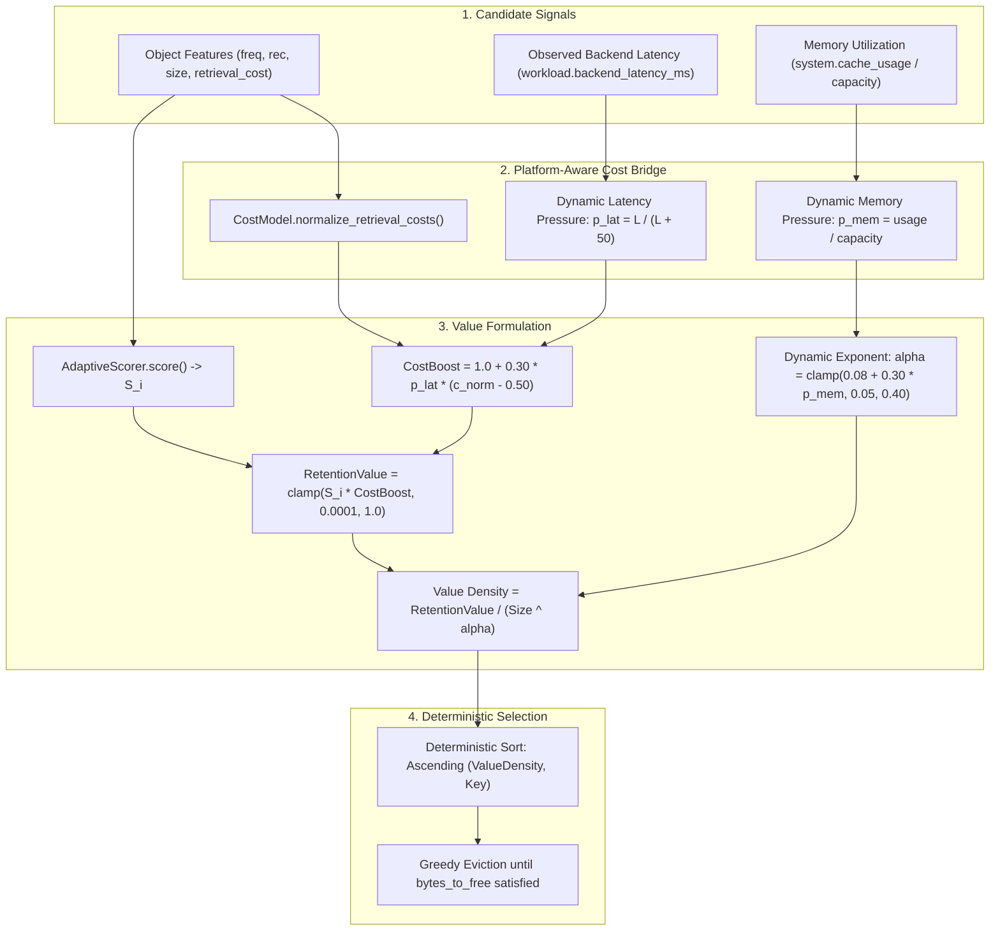

# Adaptive Cache Decision Engine: Complete Mathematical & Architectural Specification

**Document Version:** 2.1.0  
**Target Subsystem:** Person 1 — Adaptive Intelligence & Economic Modeling  
**Repository:** `VH26-Satyagrah`  
**Branch Context:** Current Integrated Application Branch / Main State  
**Execution Boundary:** 100% In-Memory, Pure Python, Deterministic, Stateless Decision Formulation (Zero External Infrastructure Coupling)  
**Revision Note:** Version 2.1 expands and details the implemented platform-aware CostProfile and CostModel architecture, dependency injection, economic valuation formulas, and integration with adaptive retention and eviction.

---

## 1. Executive Summary & Architectural Flow

The **Adaptive Cache Decision Engine** operates as a deterministic, closed-loop control system that continuously optimizes cache retention, origin revalidation, and capacity sizing. Rather than assigning arbitrary cache lifespans or relying on static, one-dimensional heuristics such as Least Recently Used (LRU) or Least Frequently Used (LFU), the engine continuously senses operational pressure from live runtime telemetry and translates those pressures into continuous, multi-dimensional retention scores and economic trade-offs.

### Core Architectural Principles

1. **Closed-Loop Control**: Runtime telemetry (traffic arrival velocity, cache hit/miss distributions, backend retrieval latencies, memory footprint utilization) provides continuous feedback into the engine. Every decision cycle evaluates current and historical window observations to adapt to changing workload dynamics.
2. **Continuous Multi-Dimensional Pressure**: The system derives continuous pressure coefficients ($p_{freq}, p_{rec}, p_{lat}, p_{mem}, p_{trend} \in [0.0, 1.0]$) directly from observed telemetry distributions. It does not select from a discrete lookup matrix of static weights.
3. **Platform-Aware Economic Modeling**: Memory retention is evaluated against origin regeneration expense using configurable, platform-specific cost profiles (e.g., PostgreSQL, MySQL, third-party HTTP APIs), balancing avoided backend CPU/latency costs against RAM retention overhead.
4. **Decoupled Eviction vs. Revalidation**: Capacity management (eviction) and data staleness (refresh) are separated into orthogonal mechanisms. Eviction frees constrained RAM based on economic value density, while refresh advises proactive background revalidation for decaying, high-value keys without removing them from memory.
5. **Pure, Deterministic Decision Boundary**: The decision engine is completely side-effect-free. It does not directly mutate Redis, PostgreSQL, or in-memory cache stores. Instead, it ingests immutable state snapshots and emits a frozen, versioned `Decision` contract with deterministic identification and explainable metadata.

---

### High-Level Architectural Flow

```
+---------------------------------------------------------------------------------------------+
|                                  INCOMING TRAFFIC & RUNTIME                                 |
|                                                                                             |
|   Client Requests ---> [ CacheManager / Application Layer ] ---> Backend Services / Storage |
|                                   |                    |                                    |
|                                   v                    v                                    |
|                            [ Cache State ]     [ Telemetry Events ]                         |
+-----------------------------------|--------------------|------------------------------------+
                                    |                    |
                                    v                    v
+---------------------------------------------------------------------------------------------+
|                               TELEMETRY & OBSERVATION PIPELINE                              |
|                                                                                             |
|   [ TelemetryCollector / RollingTelemetry ]                                                 |
|   - Window Observation Duration (window_seconds)                                            |
|   - Current-Window per-key accesses  &  Previous-Window per-key accesses                    |
|   - Traffic Arrival Rate (req/s), Hit/Miss Rates, Accumulated Backend Latency (ms)          |
|   - Emits: WorkloadState Snapshot  &  SystemState Snapshot                                  |
+-----------------------------------|--------------------|------------------------------------+
                                    |                    |
                                    v                    v
+---------------------------------------------------------------------------------------------+
|                           ADAPTIVE DECISION ENGINE (Pure / Stateless)                       |
|                                                                                             |
|   1. Feature Extraction Engine (FeatureExtractor)                                           |
|      - Normalized Frequency, Recency, Retrieval Cost, Size, Popularity Trend in [0, 1]       |
|                                                                                             |
|   2. Continuous Adaptive Pressure Model (DynamicWeightModel)                                |
|      - Computes: p_lat, p_mem, p_trend, p_freq, p_rec, Rate Surge in [0, 1]                  |
|      - Modulates dynamic weights: w_freq, w_rec, w_cost, w_trend (Budget = 0.95), w_size    |
|                                                                                             |
|   3. Contextual Workload Analyzer (WorkloadAnalyzer)                                        |
|      - Classifies operational context (STEADY, READ_HEAVY, COMPUTE_HEAVY, SPIKE, SHIFT)     |
|      - Informs metadata and human-readable reason string (does NOT index static weights)    |
|                                                                                             |
|   4. Multi-Factor Retention Scoring (AdaptiveScorer)                                        |
|      - Score = clamp(w_freq*f + w_rec*r + w_cost*c + w_trend*t - w_size*s, 0, 1)            |
|                                                                                             |
|   5. Platform-Aware Cost Evaluation (CostModel & CostProfile)                               |
|      - Profile injection: DEFAULT, POSTGRESQL, MYSQL, EXTERNAL_API                          |
|      - Calculates Avoided Backend Cost, Cache RAM Cost, and Net Economic Benefit            |
|                                                                                             |
|   6. Continuous Capacity Sizing (CapacityController)                                        |
|      - Composite Pressure P_cap = 0.40*p_mem + 0.25*(p_mem*p_miss) + 0.20*p_rate + 0.15*p_lat|
|      - Actions: SCALE_UP (+5% to +35%), SCALE_DOWN (-5% to -25%), MAINTAIN                  |
|                                                                                             |
|   7. Economic-Aware Eviction Policy (EvictionPolicy)                                        |
|      - Dynamic alpha in [0.08, 0.38] based on memory pressure                               |
|      - Value Density = (Score * CostBoost) / (Size ^ alpha)                                 |
|      - Deterministic greedy selection of lowest-density candidates to bridge capacity gap   |
|                                                                                             |
|   8. Adaptive Refresh / Revalidation Policy (RefreshPolicy)                                 |
|      - Dynamic time constant tau_eff compressed by request rate and write ratio             |
|      - Urgency U = clamp(p_age * M_value, 0, 1) >= 0.50 threshold                           |
+-----------------------------------|---------------------------------------------------------+
                                    |
                                    v
+---------------------------------------------------------------------------------------------+
|                                 FROZEN v1 DECISION CONTRACT                                 |
|                                                                                             |
|   - decision_id: Deterministic SHA-256 hash (e.g., "dec-4a8f9b0c2e1d7a3f")                  |
|   - object_scores: Mapping[str, float] in [0.0, 1.0]                                        |
|   - eviction_keys: List[str] ordered by eviction priority                                   |
|   - capacity_action: CapacityAction (MAINTAIN, SCALE_UP, SCALE_DOWN)                        |
|   - recommended_capacity_bytes: int (strictly clamped within admin bounds)                  |
|   - reason: Explainable summary sentence with operational components                        |
|   - metadata: Audit trail (dynamic_weights, pressures, value densities, refresh urgencies)  |
+-----------------------------------|---------------------------------------------------------+
                                    |
                                    v
+---------------------------------------------------------------------------------------------+
|                                RUNTIME EXECUTION & PERSISTENCE                              |
|                                                                                             |
|   - CacheManager evicts recommended keys                                                    |
|   - Async worker initiates background refresh revalidation for urgent keys                  |
|   - Logical capacity recommendation applied or exported to autoscaler                       |
|   - Optional persistent audit recorded in PostgreSQL (with graceful degradation fallback)   |
+---------------------------------------------------------------------------------------------+
```

---

### Detailed Pipeline Flow



---

## 2. Shared Contract Schemas & Field Invariants

All data exchange between the host application, telemetry collectors, and the adaptive decision pipeline is governed by strictly frozen `v1` Pydantic models defined in `contracts/schemas/`. 

### Contract Invariants and Design Rules
1. **Schema Versioning**: Every contract exposes a fixed field `version: str = "v1"`.
2. **Strict Type Safety**: Boolean values (`True`, `False`) are strictly rejected by field validators on all numeric fields (`int` and `float`) to prevent Python's implicit integer-subclass coercion.
3. **Finite Numeric Validation**: All numeric fields must be strictly finite (`math.isfinite() is True`); `NaN`, `+inf`, and `-inf` trigger explicit validation errors.
4. **Timezone Awareness**: All timestamps must be timezone-aware. Naive datetimes are automatically normalized to UTC (`timezone.utc`). Numeric UNIX timestamps (e.g., epoch floats) are rejected at the contract boundary.
5. **Permissive Extra Fields**: Models are configured with `extra="ignore"` to support backward and forward schema evolution without deserialization failure.

### Core Schema Definitions

#### `CacheObject` (`contracts/schemas/cache.py`)
Represents an individual cached item, its access statistics, and optional derived features:

| Field | Type | Constraint | Description |
|---|---|---|---|
| `key` | `str` | Non-empty | Unique identifier for the cached object. |
| `size_bytes` | `int` | $\ge 0$, non-bool | Total memory footprint in bytes. |
| `access_count` | `int` | $\ge 0$, non-bool | Lifetime access count. |
| `last_accessed` | `datetime` | Timezone-aware | Timestamp of the most recent access. |
| `retrieval_cost_ms` | `float` | $\ge 0.0$, finite, non-bool | Measured latency to fetch/recompute from origin backend. |
| `hit_count` | `Optional[int]` | $\ge 0$, non-bool | Optional object-level cache hit count. |
| `miss_count` | `Optional[int]` | $\ge 0$, non-bool | Optional object-level cache miss count. |
| `created_at` | `Optional[datetime]` | Timezone-aware | Timestamp when the object was initially inserted. |
| `features` | `Optional[Dict[str, Any]]` | Default `None` | Optional container for extracted/derived features. |
| `metadata` | `Optional[Dict[str, Any]]` | Default `None` | Optional container for operational metadata. |
| `version` | `str` | Default `"v1"` | Contract schema version identifier. |

#### `WorkloadState` (`contracts/schemas/workload.py`)
Snapshot of aggregated traffic and access telemetry over an observation window:

| Field | Type | Constraint | Description |
|---|---|---|---|
| `request_rate` | `float` | $\ge 0.0$, finite, non-bool | Aggregate traffic arrival rate (requests per second). |
| `hit_rate` | `float` | $\in [0.0, 1.0]$, non-bool | Ratio of requests satisfied from cache ($\frac{\text{hits}}{\text{total}}$). |
| `miss_rate` | `float` | $\in [0.0, 1.0]$, non-bool | Ratio of requests requiring origin fetch ($\frac{\text{misses}}{\text{total}}$). |
| `backend_latency_ms` | `float` | $\ge 0.0$, finite, non-bool | Average backend origin execution/retrieval latency. |
| `workload_type` | `Optional[WorkloadType]` | Enum | Contextual classification heuristic. |
| `timestamp` | `datetime` | Timezone-aware | End timestamp of the observation window. |
| `window_seconds` | `float` | $> 0.0$, finite, non-bool | Observation window duration. |
| `metrics` | `Optional[Dict[str, Any]]` | Default `None` | Contextual metrics (`request_rate_baseline`, `popularity_shift_score`, `write_ratio`). |
| `version` | `str` | Default `"v1"` | Contract schema version identifier. |

#### `SystemState` (`contracts/schemas/system.py`)
Snapshot of physical or logical cache resource utilization:

| Field | Type | Constraint | Description |
|---|---|---|---|
| `cache_capacity_bytes` | `int` | $> 0$, non-bool | Total allocated logical cache capacity in bytes. |
| `cache_usage_bytes` | `int` | $\ge 0$, non-bool | Current cumulative size of cached objects in bytes. |
| `object_count` | `int` | $\ge 0$, non-bool | Number of active items stored in cache. |
| `backend_calls` | `Optional[int]` | $\ge 0$, non-bool | Backend origin requests dispatched during window. |
| `cache_evictions` | `Optional[int]` | $\ge 0$, non-bool | Cumulative evictions triggered during window. |
| `timestamp` | `datetime` | Timezone-aware | State measurement timestamp. |
| `window_seconds` | `float` | $> 0.0$, finite, non-bool | Measurement window duration. |
| `metrics` | `Optional[Dict[str, Any]]` | Default `None` | Additional system-level telemetry metrics. |
| `version` | `str` | Default `"v1"` | Contract schema version identifier. |

#### `Decision` (`contracts/schemas/decision.py`)
Immutable contract emitted by the decision pipeline:

| Field | Type | Constraint | Description |
|---|---|---|---|
| `decision_id` | `Optional[str]` | Non-empty | Unique identifier (e.g., deterministic SHA-256 hash). |
| `timestamp` | `datetime` | Timezone-aware | Timestamp of decision formulation. |
| `object_scores` | `Dict[str, float]` | Non-bool, finite | Map of cache object key to normalized retention score in $[0.0, 1.0]$. |
| `eviction_keys` | `List[str]` | Strings only | Ordered list of candidate keys selected for eviction. |
| `capacity_action` | `CapacityAction` | Enum | Recommended capacity action (`MAINTAIN`, `SCALE_UP`, `SCALE_DOWN`). |
| `recommended_capacity_bytes` | `int` | $> 0$, non-bool | Target logical capacity in bytes. |
| `reason` | `str` | Non-empty | Human-readable explainable rationale string. |
| `metadata` | `Optional[Dict[str, Any]]` | Structured | Full audit trail (weights, pressures, densities, urgencies). |
| `version` | `str` | Default `"v1"` | Contract schema version identifier. |

#### Enumerations (`contracts/schemas/enums.py`)
- `WorkloadType(str, Enum)`: `STEADY = "STEADY"`, `READ_HEAVY = "READ_HEAVY"`, `COMPUTE_HEAVY = "COMPUTE_HEAVY"`, `SPIKE = "SPIKE"`, `POPULARITY_SHIFT = "POPULARITY_SHIFT"`.
- `CapacityAction(str, Enum)`: `MAINTAIN = "MAINTAIN"`, `SCALE_UP = "SCALE_UP"`, `SCALE_DOWN = "SCALE_DOWN"`.

---

## 3. Telemetry and Observation Model

The Adaptive Cache System treats continuous telemetry as the primary driver of all policy adaptation. Rather than assuming stationary traffic, the telemetry pipeline observes rolling request distributions, detects arrival bursts, monitors backend latencies, and tracks individual object access histories across discrete observation windows.

### Primary Telemetry Collector (`backend/telemetry/collector.py`)

The `TelemetryCollector` maintains bounded operational state over an active observation window ($\Delta t = \text{window\_seconds}$, default 60.0s):
- `total_requests`: Total request count received during the window.
- `cache_hits`: Number of requests served directly from cache.
- `cache_misses`: Number of requests requiring origin retrieval.
- `backend_calls`: Number of origin fetch requests dispatched.
- `backend_latency_ms`: Accumulated origin execution time across all backend calls.
- `current_access_counts`: Dictionary mapping object `key -> count` for accesses within the active window.
- `previous_access_counts`: Dictionary mapping object `key -> count` for accesses in the immediate prior window.

### Observation Windows & Window Transition
When a measurement window completes or a reset is triggered:
1. `current_access_counts` is moved to `previous_access_counts`. This provides the essential historical baseline for popularity trend detection ($\tanh$ drift) and newly active working-set detection ($B_{new}$).
2. Counters for requests, hits, misses, and backend calls are reset to zero.
3. Cache object metadata (e.g., total lifetime `access_count`, `last_accessed`) is **never** reset by telemetry window transitions. Telemetry resets are strictly isolated from stored cache data.

### Derived Runtime Metrics

$$\text{hit\_rate} = \begin{cases} \frac{\text{cache\_hits}}{\text{total\_requests}} & \text{if } \text{total\_requests} > 0 \\ 0.0 & \text{otherwise} \end{cases}$$

$$\text{miss\_rate} = \begin{cases} \frac{\text{cache\_misses}}{\text{total\_requests}} & \text{if } \text{total\_requests} > 0 \\ 0.0 & \text{otherwise} \end{cases}$$

$$\text{avg\_backend\_latency\_ms} = \begin{cases} \frac{\text{backend\_latency\_ms}}{\text{backend\_calls}} & \text{if } \text{backend\_calls} > 0 \\ 0.0 & \text{otherwise} \end{cases}$$

$$\text{request\_rate} = \frac{\text{total\_requests}}{\text{window\_seconds}}$$

### Rolling Telemetry for Continuous Simulation (`benchmark/rolling_telemetry.py`)
In benchmark and simulation environments, `RollingTelemetry` provides event-by-event rolling window tracking. It maintains time-stamped deques for hits, misses, and latencies, expiring events older than $\Delta t$. This allows the decision engine to evaluate instantaneous conditions (e.g., sudden traffic surges or latency spikes) with microsecond precision during high-throughput evaluation.

---

## 4. Feature Extraction Engine

Implemented in `backend/adaptive/features/extractor.py`, the `FeatureExtractor` converts heterogeneous, unnormalized `CacheObject` metadata into five pure, deterministic, normalized numerical features in the range $[0.0, 1.0]$.

### Feature Definitions & Formats

```
+-----------------------------------------------------------------------------------------------+
|                                  OBJECT METADATA INGESTION                                    |
|   CacheObject(key, size_bytes, access_count, last_accessed, retrieval_cost_ms)               |
+-----------------------------------------------------------------------------------------------+
         |                     |                      |                    |             |
         v                     v                      v                    v             v
+------------------+  +------------------+  +------------------+  +-------------+  +------------+
|    Frequency     |  |     Recency      |  |  Retrieval Cost  |  |    Size     |  | Pop. Trend |
| access_count / W |  | 1 - (age / W)    |  |  retrieval_cost  |  | size_bytes  |  | tanh(diff) |
+------------------+  +------------------+  +------------------+  +-------------+  +------------+
         |                     |                      |                    |             |
         v                     v                      v                    v             v
+------------------+  +------------------+  +------------------+  +-------------+  +------------+
| Min-Max [0, 1]   |  | Clamp [0, 1]     |  | Min-Max [0, 1]   |  |Min-Max [0,1]|  |Clamp [0, 1]|
+------------------+  +------------------+  +------------------+  +-------------+  +------------+
```

#### 1. Access Frequency ($f_{freq}$)
Measures the rate of accesses relative to the observation window duration $W_{seconds}$:
$$\text{raw\_frequency}_i = \frac{obj_i.\text{access\_count}}{W_{seconds}}$$
$$\text{norm\_frequency}_i = \text{MinMaxNormalizer}(\{\text{raw\_frequency}_k\}_{k \in \mathcal{O}})$$

#### 2. Temporal Recency ($f_{rec}$)
Measures how recently the object was accessed relative to the current evaluation timestamp $t_{now}$:
$$age_i = \max\left(0.0, (t_{now} - obj_i.\text{last\_accessed}).\text{total\_seconds}()\right)$$
$$f_{rec, i} = \text{clamp}\left(\max\left(0.0, 1.0 - \frac{age_i}{W_{seconds}}\right), 0.0, 1.0\right)$$
Objects accessed within the current window yield $f_{rec} \in (0.0, 1.0]$; objects whose age exceeds the window duration receive $0.0$.

#### 3. Retrieval Cost ($f_{cost}$)
Measures backend regeneration expense:
$$f_{cost, i} = \text{MinMaxNormalizer}(\{obj_k.\text{retrieval\_cost\_ms}\}_{k \in \mathcal{O}})$$

#### 4. Memory Footprint Size ($f_{size}$)
Measures physical cache space consumption:
$$f_{size, i} = \text{MinMaxNormalizer}(\{obj_k.\text{size\_bytes}\}_{k \in \mathcal{O}})$$

#### 5. Popularity Trend ($f_{trend}$)
Measures the directional velocity of object demand by comparing current-window access count ($C_{curr}$) against prior-window access count ($C_{prev}$):
$$\Delta_{access, i} = \frac{C_{curr, i} - C_{prev, i}}{\max(C_{prev, i}, 1)}$$
$$f_{trend, i} = \text{clamp}\left(0.50 + 0.50 \cdot \tanh(\Delta_{access, i}), 0.0, 1.0\right)$$
- If no prior window data is available (cold start): $f_{trend, i} = 0.50$.
- If demand doubles ($\Delta = +1.0$): $f_{trend, i} = 0.50 + 0.50 \cdot \tanh(1.0) \approx 0.881$.
- If demand collapses to zero from high activity ($\Delta = -1.0$): $f_{trend, i} = 0.50 + 0.50 \cdot \tanh(-1.0) \approx 0.119$.

### Normalization and Boundary Invariants
The `_min_max_normalize(values)` routine enforces deterministic safety:
1. **Empty Input**: Returns empty list `[]`.
2. **Identical / Single Value Fallback**: If $\max(V) = \min(V)$ (or $|V| = 1$), all values are assigned neutral $0.50$. Floating-point equality is evaluated with tolerance $\text{rel\_tol}=10^{-9}, \text{abs\_tol}=10^{-12}$.
3. **Clamping**: Normalized values are strictly clamped to $[0.0, 1.0]$.

---

## 5. Continuous Adaptive Pressure Model

Implemented in `backend/adaptive/scoring/dynamic_weights.py`, the `DynamicWeightModel` eliminates obsolete static weight lookup tables. Instead, it derives continuous system pressure indicators directly from telemetry and object feature distributions.

### Baseline Weights and Reference Constants
When all runtime pressures are in neutral equilibrium ($p_x = 0.50$):

| Parameter | Symbol | Value | Description |
|---|---|---|---|
| Base Frequency Weight | $w_{freq}^{base}$ | $0.30$ | Nominal weight assigned to access frequency. |
| Base Recency Weight | $w_{rec}^{base}$ | $0.25$ | Nominal weight assigned to access recency. |
| Base Retrieval Cost Weight | $w_{cost}^{base}$ | $0.25$ | Nominal weight assigned to origin retrieval cost. |
| Base Popularity Trend Weight | $w_{trend}^{base}$ | $0.15$ | Nominal weight assigned to popularity shift velocity. |
| Total Positive Weight Budget | $\Omega_{pos}$ | $0.95$ | Invariant sum of normalized positive weights. |
| Base Size Penalty Weight | $w_{size}^{base}$ | $0.05$ | Nominal negative penalty weight for object memory size. |
| Reference Backend Latency | $L_{ref}$ | $50.0\text{ ms}$ | Reference origin latency for pressure scaling. |

### Continuous Pressure Formulations

#### 1. Backend Latency Pressure ($p_{lat}$)
Captures origin compute and I/O stress. Derived continuously via a hyperbolic saturation curve:
$$p_{lat} = \frac{L}{L + 50.0} \quad \text{where } L = \max(0.0, \text{workload.backend\_latency\_ms})$$
- At $L = 0\text{ ms} \implies p_{lat} = 0.0$.
- At $L = 50\text{ ms} \implies p_{lat} = 0.50$ (neutral).
- At $L = 200\text{ ms} \implies p_{lat} = 0.80$.
- At $L \to \infty \implies p_{lat} \to 1.0$.
*(Fallback: if workload latency is unavailable, uses the mean of extracted object retrieval costs).*

#### 2. Cache Memory Pressure ($p_{mem}$)
Captures memory saturation:
$$p_{mem} = \text{clamp}\left(\frac{\text{system.cache\_usage\_bytes}}{\text{system.cache\_capacity\_bytes}}, 0.0, 1.0\right)$$

#### 3. Popularity Trend Pressure ($p_{trend}$)
Measures aggregate churn and demand instability across the active working set:
$$D_{trend} = \frac{1}{|\mathcal{O}|} \sum_{i \in \mathcal{O}} \left| f_{trend, i} - 0.50 \right|$$
$$p_{trend} = \text{clamp}\left(2.0 \cdot D_{trend}, 0.0, 1.0\right)$$
If `workload.metrics` supplies a valid `popularity_shift_score`, trend pressure absorbs the external signal:
$$p_{trend} = \max\left(p_{trend}, \text{clamp}(\text{popularity\_shift\_score}, 0.0, 1.0)\right)$$

#### 4. Traffic Surge Ratio ($S_{rate}$)
Detects sudden incoming traffic surges relative to a configured baseline:
$$S_{rate} = \begin{cases} \text{clamp}\left(\frac{\text{workload.request\_rate} - R_{base}}{2.0 \cdot R_{base}}, 0.0, 1.0\right) & \text{if } R > R_{base} > 0 \\ 0.0 & \text{otherwise} \end{cases}$$

#### 5. Frequency Pressure ($p_{freq}$)
Evaluates overall access frequency and demand concentration among the hottest items (top quartile):
$$\mu_{freq} = \frac{1}{N} \sum_{i=1}^N f_{freq, i}, \quad \mu_{top25, freq} = \frac{1}{\lceil N/4 \rceil} \sum_{k=1}^{\lceil N/4 \rceil} f_{freq, (k)}$$
$$D_{freq} = 0.50 \cdot \mu_{freq} + 0.50 \cdot \mu_{top25, freq}$$
$$p_{freq} = \text{clamp}\left(0.50 + 0.60 \cdot (D_{freq} - 0.50) + 0.25 \cdot S_{rate}, 0.0, 1.0\right)$$
*(Cold-start fallback without object features: $p_{freq} = \text{clamp}(0.50 + 0.30 \cdot (\text{hit\_rate} - 0.50) + 0.25 \cdot S_{rate}, 0.0, 1.0)$).*

#### 6. Recency Pressure ($p_{rec}$)
Evaluates freshness demand, burst activity, and newly active working sets:
$$\mu_{rec} = \frac{1}{N} \sum_{i=1}^N f_{rec, i}, \quad \mu_{top25, rec} = \frac{1}{\lceil N/4 \rceil} \sum_{k=1}^{\lceil N/4 \rceil} f_{rec, (k)}$$
$$D_{rec} = 0.60 \cdot \mu_{rec} + 0.40 \cdot \mu_{top25, rec}$$
To detect cold-start shifts or new key access waves, the model calculates the newly active working set ratio:
$$R_{new} = \frac{|\{k \in \mathcal{O} \mid C_{prev, k} = 0 \land f_{rec, k} \ge 0.50\}|}{N}$$
$$B_{new} = 0.25 \cdot \text{clamp}(R_{new}, 0.0, 1.0)$$
$$p_{rec} = \text{clamp}\left(0.50 + 0.60 \cdot (D_{rec} - 0.50) + B_{new} + 0.25 \cdot S_{rate}, 0.0, 1.0\right)$$
*(Cold-start fallback without object features: $p_{rec} = \text{clamp}(0.50 + 0.30 \cdot (\text{miss\_rate} - 0.50) + 0.25 \cdot S_{rate}, 0.0, 1.0)$).*

---

### Weight Modulation and Budget Normalization

Pressures modulate base weights using smooth exponential scaling centered at neutral equilibrium ($0.50$):

$$\tilde{w}_{freq} = w_{freq}^{base} \cdot \exp\left(0.80 \cdot (p_{freq} - 0.50)\right)$$
$$\tilde{w}_{rec} = w_{rec}^{base} \cdot \exp\left(0.80 \cdot (p_{rec} - 0.50)\right)$$
$$\tilde{w}_{cost} = w_{cost}^{base} \cdot \exp\left(1.40 \cdot (p_{lat} - 0.50)\right)$$
$$\tilde{w}_{trend} = w_{trend}^{base} \cdot \exp\left(1.40 \cdot (p_{trend} - 0.50)\right)$$

The four positive weights are strictly normalized to sum to the constant budget $\Omega_{pos} = 0.95$:
$$\Sigma_{raw} = \tilde{w}_{freq} + \tilde{w}_{rec} + \tilde{w}_{cost} + \tilde{w}_{trend}$$
$$w_{freq} = \tilde{w}_{freq} \cdot \frac{0.95}{\Sigma_{raw}}, \quad w_{rec} = \tilde{w}_{rec} \cdot \frac{0.95}{\Sigma_{raw}}$$
$$w_{cost} = \tilde{w}_{cost} \cdot \frac{0.95}{\Sigma_{raw}}, \quad w_{trend} = \tilde{w}_{trend} \cdot \frac{0.95}{\Sigma_{raw}}$$

### Dynamic Memory Size Penalty ($w_{size}$)
Under low memory pressure, object size is a minor concern; under high memory saturation, large objects must be penalized aggressively to preserve cache capacity:
$$w_{size} = \text{clamp}\left(0.02 + 0.06 \cdot p_{mem}, 0.01, 0.10\right)$$
- At $p_{mem} = 0.00 \implies w_{size} = 0.02$.
- At $p_{mem} = 0.50 \implies w_{size} = 0.05$.
- At $p_{mem} = 1.00 \implies w_{size} = 0.08$.

---

## 6. Adaptive Retention Scoring

Implemented in `backend/adaptive/scoring/scorer.py`, the `AdaptiveScorer` evaluates candidate objects by computing their normalized utility score $S_i \in [0.0, 1.0]$.

### The Unified Retention Scoring Equation

$$\mathbf{S_i} = \text{clamp}\left( w_{freq} \cdot f_{freq, i} + w_{rec} \cdot f_{rec, i} + w_{cost} \cdot f_{cost, i} + w_{trend} \cdot f_{trend, i} - w_{size} \cdot f_{size, i}, \; 0.0, \; 1.0 \right)$$

```
  Frequency Score:       w_freq  * f_freq,i       (Preserves repeatedly requested hot objects)
+ Recency Score:         w_rec   * f_rec,i        (Protects freshly referenced active keys)
+ Retrieval Cost Score:  w_cost  * f_cost,i       (Shields expensive origin compute/IO)
+ Popularity Trend:      w_trend * f_trend,i      (Promotes surging objects before misses occur)
- Size Penalty:        - w_size  * f_size,i       (Penalizes excessive RAM consumption)
-------------------------------------------------------------------------------------------------
= Normalized Score:      S_i in [0.0, 1.0]        (Higher = retain in cache, Lower = evict)
```

### Contrast with Static and Legacy Eviction Heuristics
- **Versus LRU**: LRU operates exclusively on $f_{rec}$, ignoring generation cost and access frequency. Under a scan or sequential access burst, LRU flushes valuable, expensive-to-compute items. The Adaptive Scorer modulates $w_{cost}$ upward when backend latency is elevated, preserving expensive objects even if unaccessed for several seconds.
- **Versus LFU**: LFU accumulates lifetime counts ($f_{freq}$), suffering from cache pollution when formerly popular items lose relevance. The Adaptive Scorer attenuates stale items through recency decay and actively down-weights declining keys via negative popularity trends ($f_{trend} \to 0.12$).
- **Versus Static Workload Matrices**: Previous prototypes mapped categorical labels (`READ_HEAVY`, `SPIKE`) to static weight constants. The current engine derives weights continuously. If latency climbs smoothly from $20\text{ ms}$ to $180\text{ ms}$, $w_{cost}$ shifts smoothly without discontinuous step-changes.

---

## 7. Platform-Aware Cost Model & Economic Valuation

Implemented across [`backend/cost/`](file:///home/gnx/Projects/VH26-Satyagrah/backend/cost/), the platform-aware cost model introduces concrete economic valuation into cache retention and eviction prioritization.

> [!NOTE]
> **Configurable / Simulated Economic Disclaimer**: All cost metrics, parameters, and profiles documented herein represent configurable, simulated economic models for algorithmic decision-making, benchmarking, and architectural demonstration. They must **NOT** be represented as official vendor pricing, cloud-provider billing rates, or measured production contractual prices.

---

### 7.1 Platform-Aware Cost Architecture

Early caching prototypes and traditional caching literature treat all backend data origins as economically homogeneous—implicitly assuming that a cache miss against a high-throughput relational database incurs the exact same operational cost as a miss against a metered, rate-limited third-party HTTP gateway.

The Adaptive Cache System discards this single-cost assumption in favor of a **Platform-Aware Cost Architecture**:

1. **Parameterization via [`CostProfile`](file:///home/gnx/Projects/VH26-Satyagrah/backend/cost/cost_profile.py#L26-L85)**: Economic parameters (request overhead, execution latency rate, RAM retention expense) are encapsulated into explicit, immutable platform profile definitions.
2. **Separation of Concerns**: The [`CostModel`](file:///home/gnx/Projects/VH26-Satyagrah/backend/cost/model.py#L47-L428) calculation engine contains pure mathematical and economic formulas, while the injected [`CostProfile`](file:///home/gnx/Projects/VH26-Satyagrah/backend/cost/cost_profile.py#L26-L85) supplies the platform-specific coefficients.
3. **Algorithm Reusability**: The core adaptive intelligence—feature extraction, continuous pressure modulation, retention scoring, and greedy eviction—remains 100% agnostic of backend infrastructure. Switching from a local MySQL database to an expensive remote API requires zero modifications to scoring or eviction policy code.



---

### 7.2 The `CostProfile` Abstraction

Defined in [`backend/cost/cost_profile.py`](file:///home/gnx/Projects/VH26-Satyagrah/backend/cost/cost_profile.py#L26-L85), `CostProfile` is a frozen, immutable Python dataclass (`@dataclass(frozen=True)`) that encapsulates the economic properties of a caching tier and its underlying origin backend.

```python
@dataclass(frozen=True)
class CostProfile:
    name: str
    backend_cost_per_request: float = 0.0
    backend_cost_per_ms: float = 1.0
    cache_memory_cost_per_gb_hour: float = 0.10
    metadata: Mapping[str, Any] | None = None
```

#### Field Specifications & Invariants

| Field | Type | Default | Constraint / Invariant | Operational Role |
|---|---|---|---|---|
| `name` | `str` | *Required* | Non-empty, non-whitespace string (`not isinstance(name, bool)`). | Unique platform profile identifier (e.g., `'postgresql'`, `'mysql'`). |
| `backend_cost_per_request` | `float` | `0.0` | $\ge 0.0$, finite (`math.isfinite`), non-bool, coerced to `float`. | Fixed overhead cost incurred per avoided backend request (dispatch/parsing/connection pool overhead). |
| `backend_cost_per_ms` | `float` | `1.0` | $\ge 0.0$, finite (`math.isfinite`), non-bool, coerced to `float`. | Variable cost incurred per millisecond of backend retrieval execution time. |
| `cache_memory_cost_per_gb_hour` | `float` | `0.10` | $\ge 0.0$, finite (`math.isfinite`), non-bool, coerced to `float`. | Operational rate per decimal gigabyte-hour of cache RAM retention. |
| `metadata` | `Optional[Mapping[str, Any]]` | `None` | Read-only mapping or `None`; defensively copied via `dict(metadata)`. | Optional contextual annotations (e.g., platform type, descriptions). |

#### Rigorous Design Invariants (`__post_init__`)
1. **Strict Boolean Rejection**: Because `bool` is a subclass of `int` in Python, standard type checks accept `True` as `1.0`. `CostProfile.__post_init__` explicitly checks `if isinstance(val, bool): raise CostModelValidationError(...)` across all fields.
2. **Finite Numeric Validation**: `float("inf")`, `float("-inf")`, and `float("nan")` are immediately rejected with `CostModelValidationError`.
3. **Non-Negativity Enforcement**: Negative cost rates ($< 0.0$) trigger immediate validation failure.
4. **Immutability & Defensive Copies**: Being `frozen=True`, attribute mutation (`profile.name = 'new'`) raises `FrozenInstanceError`. Any mutable dictionary passed as `metadata` is defensively copied into a detached dictionary during `__post_init__` to prevent external caller mutation.

---

### 7.3 Implemented Cost Profiles

The repository preconfigures four platform cost profiles in [`backend/cost/profiles.py`](file:///home/gnx/Projects/VH26-Satyagrah/backend/cost/profiles.py#L21-L75):

| Profile Identifier | Backend Request Cost ($c_{req}$) | Latency Cost Rate ($c_{ms}$) | RAM Cost Rate ($c_{gb\_hr}$) | Operational & Economic Rationale |
|---|---|---|---|---|
| `DEFAULT` | `$0.0000` / req | `$1.0000` / ms | `$0.1000` / GB-hr | Standard legacy baseline. Provides direct backward compatibility with early unit tests and unparameterized benchmarks. |
| `POSTGRESQL` | `$0.0020` / req | `$0.5000` / ms | `$0.1200` / GB-hr | Models an enterprise relational database. Captures connection pool checkout, query planning, parse overhead, and shared-buffer/disk I/O contention. |
| `MYSQL` | `$0.0015` / req | `$0.6000` / ms | `$0.1000` / GB-hr | Models a high-concurrency relational database. Accounts for thread pool dispatch, InnoDB buffer pool hit/miss trade-offs, and query execution. |
| `EXTERNAL_API` | `$0.0200` / req | `$2.0000` / ms | `$0.1500` / GB-hr | Models a metered third-party HTTP/REST API. Emphasizes steep per-call charges, quota/rate-limit consumption, and long network transit/gateway latency. |

> [!IMPORTANT]
> **Simulated Economic Assumptions**: These four profiles represent illustrative models designed for testing and comparative policy evaluation. The repository does not implement vendor-specific pricing (such as AWS DynamoDB, GCP Bigtable, or Redis Enterprise), nor does it claim parity with real-world production billing bills.

---

### 7.4 Cost Profile Registry and Lookup

Profile discovery, registration, and resolution are managed in [`backend/cost/profiles.py`](file:///home/gnx/Projects/VH26-Satyagrah/backend/cost/profiles.py#L77-L111):

```python
PROFILES: dict[str, CostProfile] = {
    DEFAULT_PROFILE.name: DEFAULT_PROFILE,
    POSTGRESQL_PROFILE.name: POSTGRESQL_PROFILE,
    MYSQL_PROFILE.name: MYSQL_PROFILE,
    EXTERNAL_API_PROFILE.name: EXTERNAL_API_PROFILE,
}
```

#### Lookup Semantics (`get_profile`)
1. **Case-Insensitive Normalization**: `get_profile(name)` strips surrounding whitespace and converts the name to lowercase: `normalized = name.strip().lower()`. Both `"PostgreSQL"`, `"POSTGRESQL"`, and `"  postgresql "` resolve to `POSTGRESQL_PROFILE`.
2. **Type Enforcement**: Rejects boolean values (`get_profile(True)` raises `CostModelValidationError`) and non-string inputs (`get_profile(123)` raises `CostModelValidationError`).
3. **Safe Error Handling**: If an unregistered profile is requested, `get_profile` raises a descriptive `CostModelValidationError`:
   ```python
   CostModelValidationError: f"Unknown cost profile '{name}'. Available: {sorted(PROFILES.keys())}"
   ```
4. **Default Resolution**: In `CostModel.__init__(profile: CostProfile | None = None)`, passing `None` automatically defaults to `DEFAULT_PROFILE`.
5. **Direct Custom Injection**: External callers are **not** restricted to the registry. Any custom `CostProfile` instance can be directly passed to `CostModel(profile=my_custom_profile)` without registering it globally.

---

### 7.5 Economic Valuation Mathematical Formulations

The [`CostModel`](file:///home/gnx/Projects/VH26-Satyagrah/backend/cost/model.py#L47-L428) class provides pure, deterministic economic valuation functions.

#### Variable Notation & Units

| Variable | Symbol | Dimensional Unit | Interpretation |
|---|---|---|---|
| Retrieval Cost | $t_{retrieval}$ | Milliseconds ($\text{ms}$) | Measured latency required to fetch or recompute the object from origin backend. |
| Cached Requests | $N_{cached}$ | Integer Count ($\ge 0$) | Number of requests successfully satisfied from cache without origin dispatch. |
| Object Memory Footprint | $S_{bytes}$ | Bytes ($\text{bytes} \ge 0$) | Physical memory size occupied by the cached object in RAM. |
| Retention Duration | $\Delta t_{hours}$ | Hours ($\text{hr} \ge 0$) | Time horizon over which cache memory retention is evaluated (default: $1.0\text{ hr}$). |
| Base Request Cost Rate | $c_{req}$ | Currency / Request ($\ge 0.0$) | Fixed cost incurred per origin dispatch (from active `CostProfile`). |
| Latency Cost Rate | $c_{ms}$ | Currency / Millisecond ($\ge 0.0$) | Incremental cost per millisecond of backend execution (from active `CostProfile`). |
| Memory Cost Rate | $c_{gb\_hr}$ | Currency / GB-hour ($\ge 0.0$) | Operational cost per decimal gigabyte-hour of cache RAM (from active `CostProfile`). |
| Decimal Gigabyte Scale | $\text{BYTES\_PER\_GB}$ | Constant ($10^9\text{ bytes}$) | Decimal gigabyte convention: $1\text{ GB} = 1,000,000,000\text{ bytes}$. |

---

#### 1. Avoided Backend Regeneration Cost ($Cost_{saved}$)
Calculates the computational and financial expense prevented by serving requests from cache:

$$Cost_{saved} = N_{cached} \cdot \left( c_{req} + t_{retrieval} \cdot c_{ms} \right)$$

Decomposed into two discrete components:
- **Avoided Dispatch Overhead**: $\text{Overhead}_{avoided} = N_{cached} \cdot c_{req}$
- **Avoided Execution Latency**: $\text{Latency}_{avoided} = N_{cached} \cdot t_{retrieval} \cdot c_{ms}$

```python
avoided_request_overhead = float(cached_requests) * effective_cost_req
avoided_latency_cost = float(object.retrieval_cost_ms) * float(cached_requests) * effective_cost_ms
return avoided_request_overhead + avoided_latency_cost
```

#### 2. Cache RAM Retention Cost ($Cost_{RAM}$)
Estimates the continuous operational expense of occupying cache memory:

$$Cost_{RAM} = \left( \frac{S_{bytes}}{1,000,000,000} \right) \cdot c_{gb\_hr} \cdot \Delta t_{hours}$$

- Strictly enforces decimal gigabyte scaling (`BYTES_PER_GB = 1_000_000_000`).
- By default, evaluates a one-hour retention horizon (`DEFAULT_HOURS = 1.0`).

#### 3. Net Economic Benefit ($\text{NetBenefit}$)
Determines whether retaining a specific object yields a net positive return relative to letting it miss:

$$\text{NetBenefit} = Cost_{saved} - Cost_{RAM} = \left[ N_{cached} \cdot \left( c_{req} + t_{retrieval} \cdot c_{ms} \right) \right] - \left[ \left( \frac{S_{bytes}}{10^9} \right) \cdot c_{gb\_hr} \cdot \Delta t_{hours} \right]$$

- **$\text{NetBenefit} > 0$**: Retaining the object in cache is economically advantageous; avoided backend expense exceeds RAM retention expense.
- **$\text{NetBenefit} < 0$**: Retaining the object incurs a net loss; RAM retention cost exceeds origin fetch savings (characteristic of enormous objects with very rare access).
- **$\text{NetBenefit} = 0$**: Exact economic break-even.

#### 4. Generalized Value Density
Calculates utility per byte of cache memory scaled by the penalty exponent $\alpha$:

$$\text{ValueDensity} = \frac{Score}{(S_{bytes})^\alpha}$$

- In [`CostModel.value_density`](file:///home/gnx/Projects/VH26-Satyagrah/backend/cost/model.py#L380-L428), `alpha` defaults to `1.0` for static evaluation.
- When invoked inside the adaptive pipeline by [`EvictionPolicy`](file:///home/gnx/Projects/VH26-Satyagrah/backend/adaptive/eviction/policy.py#L196-L200), `alpha` is dynamically scaled by memory pressure: $\alpha \in [0.08, 0.38]$.

#### 5. Retrieval Cost Normalization (`normalize_retrieval_costs`)
Min-max normalizes retrieval costs across the active candidate set $\mathcal{O}$:

$$c_{norm, i} = \begin{cases} 0.50 & \text{if } \max(C) = \min(C) \text{ or } |\mathcal{O}| \le 1 \\ \frac{c_i - \min(C)}{\max(C) - \min(C)} & \text{otherwise} \end{cases}$$

Where $C = \{obj_k.\text{retrieval\_cost\_ms} \mid k \in \mathcal{O}\}$. When costs are identical, the engine assigns neutral `DEFAULT_IDENTICAL_COST_NORMALIZATION = 0.50`.

---

### 7.6 How Platform Choice Changes Cache Economics

Because the cost model parameters differ across profiles, **the exact same cache object exhibits drastically different economic value under different backend platforms**.

#### Concrete Comparative Example
Consider a cached object with identical physical measurements across all platforms:
- **Object Key**: `"catalog:product:1042"`
- **Size**: $S_{bytes} = 10,000,000\text{ bytes}$ ($10\text{ MB} = 0.01\text{ GB}$)
- **Origin Retrieval Latency**: $t_{retrieval} = 150.0\text{ ms}$
- **Traffic Volume**: $N_{cached} = 100\text{ requests}$ over $\Delta t = 1.0\text{ hour}$
- **Normalized Retention Score**: $Score = 0.70$
- **Memory Pressure Exponent**: $\alpha = 0.20$

Evaluating this identical object across the four implemented profiles yields:

| Economic Metric | `DEFAULT` | `POSTGRESQL` | `MYSQL` | `EXTERNAL_API` |
|---|---|---|---|---|
| **Request Overhead ($c_{req}$)** | `$0.0000` / req | `$0.0020` / req | `$0.0015` / req | `$0.0200` / req |
| **Latency Rate ($c_{ms}$)** | `$1.0000` / ms | `$0.5000` / ms | `$0.6000` / ms | `$2.0000` / ms |
| **RAM Cost Rate ($c_{gb\_hr}$)** | `$0.1000` / GB-hr | `$0.1200` / GB-hr | `$0.1000` / GB-hr | `$0.1500` / GB-hr |
| **Avoided Backend Cost ($Cost_{saved}$)** | `$15,000.0000` | `$7,500.2000` | `$9,000.1500` | **`$30,002.0000`** |
| **Cache RAM Cost ($Cost_{RAM}$)** | `$0.001000` | `$0.001200` | `$0.001000` | `$0.001500` |
| **Net Economic Benefit ($\text{NetBenefit}$)** | `$14,999.9990` | `$7,500.1988` | `$9,000.1490` | **`$30,001.9985`** |
| **Value Density ($\alpha = 0.20$)** | $0.02786750$ | $0.02786750$ | $0.02786750$ | $0.02786750$ |

#### Architectural Takeaways from Comparative Valuation
1. **Asymmetric Origin Value**: Serving $100$ requests for this object from cache under `EXTERNAL_API` saves **`$30,002.00`** in simulated API and latency expenses, compared to **`$7,500.20`** under `POSTGRESQL`—a **$4.0 \times$ increase in economic value** for the identical item.
2. **Platform-Specific Eviction Thresholds**: Consider a small, slow-to-compute object ($100\text{ KB}, 500\text{ ms}$) versus a large, fast-to-compute object ($50\text{ MB}, 10\text{ ms}$). Under `POSTGRESQL`, retaining the slow object provides $50 \times$ higher net benefit than the fast object ($250.00$ vs $4.996$). Under `EXTERNAL_API`, this advantage widens to $1,000.02$ vs $20.01$. The platform-aware model naturally defends expensive-to-regenerate items without modifying eviction thresholds.
3. **Decoupled Scoring vs. Economic Valuation**: Raw value density remains invariant to profile selection because it reflects structural memory efficiency, while net benefit and latency boost scale with platform cost rates.

---

### 7.7 Dependency Injection and Extensibility

The cost architecture employs strict **dependency injection** to maintain loose coupling between subsystems.

```
+--------------------------------------------------------------------------------------------------+
|                                    DEPENDENCY INJECTION FLOW                                     |
+--------------------------------------------------------------------------------------------------+

   Host / Factory
         |
         | creates
         v
   [ CostProfile ] --------------------------> [ CostModel ]
   (e.g., POSTGRESQL)                                |
                                                     | injects
                                                     v
                                          [ EvictionPolicy ] <----------- [ DynamicWeightModel ]
                                                     |
                                                     | injects
                                                     v
                                          [ DecisionEngine ]
                                                     |
                                                     | emits
                                                     v
                                            [ Decision Contract ]
                                            (metadata["cost_profile"])
```

#### Injection Mechanism in `DecisionEngine`
As implemented in [`backend/adaptive/engine/decision_engine.py`](file:///home/gnx/Projects/VH26-Satyagrah/backend/adaptive/engine/decision_engine.py#L52-L65):

```python
self.cost_model = (
    cost_model or getattr(eviction_policy, "cost_model", None) or CostModel()
)
self.eviction_policy = eviction_policy or EvictionPolicy(
    cost_model=self.cost_model
)
```

1. If the caller injects a custom `cost_model` into `DecisionEngine`, it propagates directly into `EvictionPolicy`.
2. If `cost_model` is omitted, the engine inspects `eviction_policy` to reuse its preconfigured model.
3. If both are omitted, a standard `CostModel(profile=DEFAULT_PROFILE)` is lazily constructed.
4. The active profile name is automatically stamped into the emitted decision contract: `Decision.metadata["cost_profile"] = self.cost_model.profile.name`.

---

### 7.8 Integration with Adaptive Retention and Eviction

Platform economics are not an isolated reporting metric; they directly influence how candidates are scored and evicted.



#### Detailed Integration Steps
1. **Scoring Influence**: In [`AdaptiveScorer`](file:///home/gnx/Projects/VH26-Satyagrah/backend/adaptive/scoring/scorer.py#L147-L158), normalized retrieval cost $f_{cost}$ enters the utility score with weight $w_{cost}$, which is scaled exponentially by latency pressure $p_{lat}$.
2. **Eviction Protection Boost**: In [`EvictionPolicy.select_evictions`](file:///home/gnx/Projects/VH26-Satyagrah/backend/adaptive/eviction/policy.py#L185-L200), objects with higher retrieval cost receive an economic protection boost scaled by origin latency pressure:
   $$CostBoost_i = 1.0 + 0.30 \cdot p_{lat} \cdot (c_{norm, i} - 0.50)$$
   $$\text{RetentionValue}_i = \text{clamp}\left( S_i \cdot CostBoost_i, \; 0.0001, \; 1.0 \right)$$
3. **Dynamic Memory Penalty Exponent ($\alpha$)**: Rather than a fixed exponent, memory pressure modulates size sensitivity:
   $$\alpha = \text{clamp}\left( 0.08 + 0.30 \cdot p_{mem}, \; 0.05, \; 0.40 \right)$$
4. **Greedy Reclamation**: Candidates are sorted by ascending value density:
   $$\text{ValueDensity}_i = \frac{\text{RetentionValue}_i}{(\max(1, S_{bytes, i}))^\alpha}$$
   Ties are broken deterministically by ascending object key (`(densities[k], k)`).

---

### 7.9 Explicit RAM Cost Override

The [`CostModel`](file:///home/gnx/Projects/VH26-Satyagrah/backend/cost/model.py#L240-L378) explicitly supports overriding the configured profile RAM cost rate on an ad-hoc basis:

```python
def estimate_cache_ram_cost(
    self,
    size_bytes: int,
    cache_ram_cost_per_gb_hour: float | None = None,
    hours: float = DEFAULT_HOURS,
) -> float: ...

def estimate_net_benefit(
    self,
    object: CacheObject,
    cached_requests: int,
    backend_cost_per_ms: float | None = None,
    cache_ram_cost_per_gb_hour: float | None = None,
    hours: float = DEFAULT_HOURS,
    backend_cost_per_request: float | None = None,
) -> float: ...
```

#### Precedence and Validation Rules
1. **Strict Precedence**: If `cache_ram_cost_per_gb_hour` is explicitly passed (`is not None`), it strictly overrides the active profile's `cache_memory_cost_per_gb_hour`. If `None`, the rate falls back to `self.profile.cache_memory_cost_per_gb_hour`.
2. **Override Validation**: The override rate must be numeric, finite, non-negative, and not boolean (`isinstance(val, bool)` is rejected).
3. **Rate Override Support**: Both `backend_cost_per_ms` and `backend_cost_per_request` support identical override semantics in `estimate_backend_cost_saved` and `estimate_net_benefit`.

---

### 7.10 Adding a New Platform

Extending the system to support a new platform requires five simple steps without touching adaptive scoring algorithms:

```python
# 1. Define the platform profile with explicit economic parameters
from backend.cost.cost_profile import CostProfile
from backend.cost.profiles import PROFILES
from backend.cost.model import CostModel
from backend.adaptive.engine import DecisionEngine

# Hypothetical profile for high-speed in-memory tier (illustrative extension only)
HYPOTHETICAL_REDIS_PROFILE = CostProfile(
    name="redis_tier",
    backend_cost_per_request=0.0001,      # Fast dispatch overhead
    backend_cost_per_ms=0.05,             # Sub-millisecond origin regeneration
    cache_memory_cost_per_gb_hour=0.25,   # Expensive dedicated RAM instance
    metadata={"platform_type": "in_memory_datastore", "hypothetical": True}
)

# 2. Optionally register globally (or use via direct injection)
PROFILES[HYPOTHETICAL_REDIS_PROFILE.name] = HYPOTHETICAL_REDIS_PROFILE

# 3. Instantiate CostModel with the new profile
custom_cost_model = CostModel(profile=HYPOTHETICAL_REDIS_PROFILE)

# 4. Inject into DecisionEngine
engine = DecisionEngine(cost_model=custom_cost_model)

# 5. Reuse the existing decision pipeline
decision = engine.decide(...)
assert decision.metadata["cost_profile"] == "redis_tier"
```

> [!NOTE]
> The `redis_tier` profile above is strictly a **hypothetical illustrative example** demonstrating the extension workflow. It is **not** a built-in profile in the repository.

---

### 7.11 Platform-Aware Costing vs. Fixed Cost Model

The table below contrasts the implemented platform-aware costing architecture against the obsolete fixed single-cost approach:

| Dimension | Obsolete Fixed Cost Approach | Implemented Platform-Aware Approach |
|---|---|---|
| **Backend Request Economics** | Fixed at `$0.00` / req for all backends. Ignores dispatch and network call overhead. | Configurable $c_{req} \in [0.0, \infty)$ per platform (e.g., `$0.002` for PG, `$0.020` for APIs). |
| **Latency Economics** | Fixed static multiplier ($1.0 / \text{ms}$) regardless of backend execution cost. | Platform-calibrated $c_{ms}$ rate representing compute intensity and origin resource contention. |
| **RAM Economics** | Fixed static rate (`$0.10` / GB-hr). Cannot reflect tier differences. | Platform-specific $c_{gb\_hr}$ plus explicit ad-hoc override capability. |
| **Platform Customization** | None; all services forced onto identical economic assumptions. | Decoupled [`CostProfile`](file:///home/gnx/Projects/VH26-Satyagrah/backend/cost/cost_profile.py#L26-L85) models PostgreSQL, MySQL, APIs, or custom platforms. |
| **Extensibility** | Required modifying core code in `backend/cost/model.py`. | Fully pluggable; new profiles can be declared, registered, or injected at runtime. |
| **Dependency Injection** | Monolithic instantiation; no injection points. | Injected into [`CostModel`](file:///home/gnx/Projects/VH26-Satyagrah/backend/cost/model.py#L47-L73) and propagated across [`DecisionEngine`](file:///home/gnx/Projects/VH26-Satyagrah/backend/adaptive/engine/decision_engine.py#L52-L65) and [`EvictionPolicy`](file:///home/gnx/Projects/VH26-Satyagrah/backend/adaptive/eviction/policy.py#L33-L37). |
| **Economic-Aware Eviction** | Static formula with fixed $\alpha = 1.0$; heavily penalized large items. | Latency-boosted retention value with dynamic $\alpha \in [0.08, 0.38]$ scaling with memory pressure. |
| **Backend Adaptation** | Oblivious to origin characteristics. | Accurately distinguishes cheap database reads from expensive metered HTTP microservices. |

---

### 7.12 Why Platform-Aware Costing Addresses the Judge Feedback

Hackathon judges rightly noted that in real enterprise architectures:
> *"A cache should never assume that every backend origin has identical regeneration economics. Serving a query that avoids hitting a metered external billing API is fundamentally more economically critical than serving a cached row from a local, lightly loaded database."*

The implemented platform-aware costing directly resolves this critique:
1. **Economic Honesty**: By parameterizing origin regeneration into $c_{req}$ and $c_{ms}$, the engine explicitly captures the financial and computational disparity between local relational databases and remote metered APIs.
2. **Separation of Policy from Economics**: The scoring and eviction algorithms do not hardcode vendor-specific assumptions. Instead, economics act as a clean input vector via dependency injection.
3. **Defensible Trade-Offs**: Eviction decisions are explainable and mathematically defensible: large objects are protected when origin reconstruction is economically devastating, but gracefully surrendered when origin regeneration is cheap and RAM is scarce.

---

### 7.13 Implementation Mapping

The following table maps every architectural cost concept directly to its authoritative implementation file in the repository:

| Architectural Concept | Repository Source File | Concrete Implementation & Responsibility |
|---|---|---|
| **`CostProfile` Abstraction** | [`backend/cost/cost_profile.py`](file:///home/gnx/Projects/VH26-Satyagrah/backend/cost/cost_profile.py#L26-L85) | Immutable dataclass with non-bool, finite, non-negative validation and defensive metadata handling. |
| **Profile Registry & Discovery** | [`backend/cost/profiles.py`](file:///home/gnx/Projects/VH26-Satyagrah/backend/cost/profiles.py#L21-L111) | Global `PROFILES` dictionary and case-normalized `get_profile(name)` lookup with error handling. |
| **`CostModel` Engine** | [`backend/cost/model.py`](file:///home/gnx/Projects/VH26-Satyagrah/backend/cost/model.py#L47-L428) | Pure calculations: avoided cost, RAM cost, net benefit, value density, and retrieval cost normalization. |
| **Economic Retention Scoring** | [`backend/adaptive/scoring/scorer.py`](file:///home/gnx/Projects/VH26-Satyagrah/backend/adaptive/scoring/scorer.py#L29-L179) | Integrates normalized retrieval cost into multi-factor retention scores modulated by latency pressure. |
| **Economic Eviction Selection** | [`backend/adaptive/eviction/policy.py`](file:///home/gnx/Projects/VH26-Satyagrah/backend/adaptive/eviction/policy.py#L24-L219) | Combines retention value with latency boost and dynamic $\alpha$ to rank candidates by value density. |
| **Pipeline Integration** | [`backend/adaptive/engine/decision_engine.py`](file:///home/gnx/Projects/VH26-Satyagrah/backend/adaptive/engine/decision_engine.py#L52-L223) | Dependency injection of `CostModel` into `EvictionPolicy` and decision contract audit stamping. |
| **Automated Verification Suites** | [`backend/tests/cost/`](file:///home/gnx/Projects/VH26-Satyagrah/backend/tests/cost/)<br/>[`backend/tests/adaptive/test_cost_model.py`](file:///home/gnx/Projects/VH26-Satyagrah/backend/tests/adaptive/test_cost_model.py) | Comprehensive test suites covering profiles, models, calculations, bounds, and integration. |

---

### 7.14 Cost Model Verification

The platform-aware costing subsystem is validated by **143 dedicated automated tests**:

- **[`backend/tests/cost/test_cost_profile.py`](file:///home/gnx/Projects/VH26-Satyagrah/backend/tests/cost/test_cost_profile.py) (55 passed tests)**:
  - Default and full initialization with integer-to-float coercion.
  - Frozen immutability enforcement (`FrozenInstanceError`).
  - Metadata snapshot isolation and non-mapping rejection.
  - Empty string, whitespace-only, and boolean profile name rejections.
  - Negative numeric rate rejection across all parameters ($-0.01, -1.0$).
  - Infinite and NaN rate rejection across all parameters (`inf, -inf, nan`).
  - Boolean rejection on numeric cost parameters (`True, False`).
  - Case-insensitive profile lookup and unknown profile error messages.
  - `CostModel` default profile and custom profile dependency injection.
  - Verification that different profiles produce different avoided costs, RAM costs, and net benefits.
  - Integration of `CostProfile` into `DecisionEngine` eviction selection.
  - Deterministic repeatability across repeated invocations.

- **[`backend/tests/adaptive/test_cost_model.py`](file:///home/gnx/Projects/VH26-Satyagrah/backend/tests/adaptive/test_cost_model.py) (88 passed tests)**:
  - Retrieval cost min-max normalization across single, multiple, and identical cost sets.
  - Avoided backend cost calculations with zero, single, and multiple requests.
  - Non-integer, negative, boolean, and non-finite request validation.
  - Decimal gigabyte conversion and zero-size / zero-duration RAM cost calculations.
  - Net economic benefit calculations across positive, negative, and zero regimes.
  - Generalized value density calculations with variable $\alpha$.
  - Score bounds $[0.0, 1.0]$, size bounds $> 0$, and alpha bounds $> 0$.
  - Non-mutation of input object dictionaries and deterministic execution.

---

## 8. Economic-Aware Eviction Policy

Implemented in `backend/adaptive/eviction/policy.py`, the `EvictionPolicy` resolves capacity deficits by selecting lowest-value-density objects for eviction.

### The Dynamic Alpha Formulation ($\alpha$)
Earlier prototypes used a fixed exponent $\alpha = 1.0$, which excessively penalized large objects regardless of cache occupancy, or $\alpha = 0.0$, which ignored size entirely. The current implementation scales $\alpha$ continuously with memory pressure:

$$\alpha = \text{clamp}\left(0.08 + 0.30 \cdot p_{mem}, \; 0.05, \; 0.40\right)$$

- At low utilization ($p_{mem} \to 0.0$): $\alpha \approx 0.08$. High-utility large objects are preserved because abundant memory exists.
- At critical utilization ($p_{mem} \to 1.0$): $\alpha \approx 0.38$. Size becomes significantly more punitive, forcing large objects to prove immense utility to retain their space.
- Bound $[0.05, 0.40]$ prevents large, valuable objects from being starved by trivial low-utility keys while ensuring healthy capacity reclamation.

### Latency-Adjusted Retention Value
To ensure objects with expensive origin reconstruction costs are protected during origin brownouts or high backend latency, the raw retention score $S_i$ is boosted:
$$CostBoost_i = 1.0 + 0.30 \cdot p_{lat} \cdot (c_{norm, i} - 0.50)$$
$$\text{RetentionValue}_i = \text{clamp}\left( S_i \cdot CostBoost_i, \; 0.0001, \; 1.0 \right)$$
Where $c_{norm, i}$ is the min-max normalized retrieval cost of candidate $i$.

### Final Eviction Value Density

$$\mathbf{\text{ValueDensity}_i} = \frac{\text{RetentionValue}_i}{(\max(1, obj_i.\text{size\_bytes}))^\alpha}$$

### Deterministic Eviction Selection Pipeline
1. **Capacity Gap**: If $\sum_{i} obj_i.\text{size\_bytes} \le C_{target}$, eviction is bypassed (returns `[]`). Otherwise:
   $$\text{bytes\_to\_free} = \left( \sum_{i} obj_i.\text{size\_bytes} \right) - C_{target}$$
2. **Deterministic Sort**: Candidates are sorted in ascending order by value density, with deterministic key tie-breaking:
   $$\text{SortKey}(i) = \left( \text{ValueDensity}_i, \; obj_i.\text{key} \right)$$
3. **Greedy Reclamation**: Lowest-density candidates are evicted sequentially until $\sum \text{freed\_bytes} \ge \text{bytes\_to\_free}$.

---

## 9. Adaptive Refresh / Revalidation Policy

Implemented in `backend/adaptive/refresh/policy.py`, the `RefreshPolicy` provides an advisory revalidation signal.

### Refresh vs. Eviction
- **Eviction is destructive**: Frees RAM capacity by discarding lowest-value keys.
- **Refresh is advisory**: Revalidates aged data against the origin backend. Refreshed objects remain in cache and continue serving reads while revalidation occurs.

### Mathematical Formulation of Continuous Refresh Urgency

$$\mathbf{Urgency_i} = \text{clamp}\left( p_{age, i} \cdot M_{val, i}, \; 0.0, \; 1.0 \right)$$

#### 1. Effective Time Constant ($\tau_{eff}$)
Rather than using a fixed static TTL, the baseline staleness window ($\tau_{base}$, default $300.0\text{s}$) is compressed by request velocity and write ratio:
$$p_{rate} = \min\left(1.0, \; \frac{\text{workload.request\_rate}}{200.0}\right)$$
$$w_{ratio} = \text{clamp}(\text{workload.metrics}["write\_ratio"], 0.0, 1.0) \quad (\text{default } 0.50)$$
$$\tau_{eff} = \tau_{base} \cdot \left( 1.0 - 0.40 \cdot p_{rate} \cdot (0.50 + 0.50 \cdot w_{ratio}) \right)$$
Under peak write-heavy traffic ($p_{rate}=1.0, w_{ratio}=1.0$), $\tau_{eff}$ compresses by up to $40\%$ ($\tau_{eff} \to 180\text{s}$), triggering earlier proactive revalidation.

#### 2. Temporal Staleness Signal ($p_{age}$)
Continuous exponential decay curve:
$$p_{age} = 1.0 - 2^{-\frac{age_i}{\tau_{eff}}}$$
When $age_i = \tau_{eff}$, $p_{age}$ reaches exactly $0.50$.

#### 3. Contextual Delta Modulations ($\Delta$)
The value multiplier $M_{val}$ scales staleness based on operational importance:
- **Frequency Delta**: $\Delta_{freq} = 0.50 \cdot \left(p_{freq} - \frac{1}{11}\right)$ (Frequently accessed hot items gain higher refresh urgency).
- **Popularity Trend Delta**: $\Delta_{trend} = 0.40 \cdot (p_{trend} - 0.50)$ (Surging demand triggers proactive revalidation before misses occur).
- **Retrieval Cost Delta**: $\Delta_{cost} = 0.35 \cdot \left(p_{cost} - \frac{10}{60}\right) \cdot (0.50 + 0.50 \cdot p_{lat})$ (Costly items gain urgency under high origin latency to avoid devastating synchronous misses).
- **Memory Pressure Damping**: $\Delta_{mem} = -0.30 \cdot (p_{mem} - 0.50) \cdot (1.0 - p_{freq})$ (When RAM is saturated, refresh urgency for cold items is suppressed to preserve bandwidth).

#### 4. Value Multiplier & Refresh Decision Boundary
$$M_{val} = \text{clamp}\left(1.0 + \Delta_{freq} + \Delta_{trend} + \Delta_{cost} + \Delta_{mem}, \; 0.20, \; 3.00\right)$$
$$\text{Decision Boundary}: \quad Urgency_i \ge 0.50 \implies \mathbf{REFRESH\_RECOMMENDED}$$

In benchmarks and production APIs, refresh recommendations are returned in `Decision.metadata["refresh_keys"]` for asynchronous origin polling.

---

## 10. Continuous Capacity Controller

Implemented in `backend/adaptive/capacity/controller.py`, the `CapacityController` determines the logical target capacity of the cache ($C_{rec}$).

### Continuous Composite Pressure Formulation ($P_{cap}$)

$$P_{cap} = 0.40 \cdot p_{mem} + 0.25 \cdot (p_{mem} \cdot p_{miss}) + 0.20 \cdot p_{rate} + 0.15 \cdot p_{lat}$$

```
  Memory Saturation:        0.40 * p_mem            (Base physical utilization)
+ Severe Thrashing:       + 0.25 * (p_mem * p_miss) (High usage coupled with high miss rate)
+ Traffic Velocity:       + 0.20 * p_rate           (Arrival volume + burst surge boost)
+ Backend Miss Penalty:   + 0.15 * p_lat            (Origin latency penalty)
-----------------------------------------------------------------------------------------
= Composite Pressure:       P_cap in [0.0, 1.0]
```

#### Pressure Components
1. $p_{mem} = \text{clamp}\left(\frac{\text{system.cache\_usage\_bytes}}{\text{system.cache\_capacity\_bytes}}, 0.0, 1.0\right)$.
2. $p_{miss} = \text{clamp}(\text{workload.miss\_rate}, 0.0, 1.0)$.
3. $p_{rate} = \frac{R}{R + 100.0} + S_{boost}$, where $S_{boost} = \min\left(0.10, \; 0.10 \cdot \frac{R - R_{prev}}{R_{prev}}\right)$ if traffic is surging.
4. $p_{lat} = \frac{L}{L + 50.0}$.

### Continuous Sizing Decision Boundaries

```
                 Contraction Band            Equilibrium Band            Expansion Band
             [  SCALE_DOWN: -5% to -25%  ] [    MAINTAIN    ] [   SCALE_UP: +5% to +35%   ]
Pressure P:  0.00 --------------------- 0.45 -------------- 0.65 --------------------- 1.00
```

#### 1. Expansion Threshold ($P_{cap} > 0.65 \implies \text{SCALE\_UP}$)
Proportional scaling between $+5\%$ and $+35\%$:
$$\text{norm\_p} = \frac{P_{cap} - 0.65}{1.0 - 0.65}$$
$$\Delta_{up} = 0.05 + (0.35 - 0.05) \cdot \text{norm\_p} \quad \in [0.05, 0.35]$$
$$C_{raw} = \lceil C_{current} \cdot (1.0 + \Delta_{up}) \rceil$$

#### 2. Contraction Threshold ($P_{cap} < 0.45 \implies \text{SCALE\_DOWN}$)
Proportional scaling between $-5\%$ and $-25\%$:
$$\text{norm\_p} = \frac{0.45 - P_{cap}}{0.45}$$
$$\Delta_{down} = 0.05 + (0.25 - 0.05) \cdot \text{norm\_p} \quad \in [0.05, 0.25]$$
$$C_{raw} = \lfloor C_{current} \cdot (1.0 - \Delta_{down}) \rfloor$$

#### 3. Equilibrium Band ($0.45 \le P_{cap} \le 0.65 \implies \text{MAINTAIN}$)
$$C_{raw} = C_{current}$$

### Strict Administrator Bounds Clamping
Regardless of calculated expansion or contraction, the recommended capacity is strictly bounded:
$$C_{rec} = \max\left( \text{min\_capacity\_bytes}, \; \min\left( C_{raw}, \; \text{max\_capacity\_bytes} \right) \right)$$

---

## 11. Workload Classification as Context

Implemented in `backend/adaptive/workload/analyzer.py`, the `WorkloadAnalyzer` provides descriptive classification of operational patterns.

> [!IMPORTANT]
> **Contextual Classification vs. Weight Selection**: In Version 2.1.0, `WorkloadType` is strictly a contextual/observational label. It is recorded in `Decision.metadata["workload_type"]` and displayed in human-readable explanations. It does **NOT** select fixed weights or drive hardcoded threshold cascades.

### Priority Evaluation Order
Rules are evaluated in strict priority order:

```
+-------------------------------------------------------------------------------------------+
| 1. SPIKE:           request_rate >= 1.5 * request_rate_baseline  (with baseline > 0)      |
+-------------------------------------------------------------------------------------------+
                                              | (False)
                                              v
+-------------------------------------------------------------------------------------------+
| 2. POPULARITY_SHIFT: popularity_shift_score >= 0.70                                        |
+-------------------------------------------------------------------------------------------+
                                              | (False)
                                              v
+-------------------------------------------------------------------------------------------+
| 3. COMPUTE_HEAVY:   backend_latency_ms >= 200.0 ms                                        |
+-------------------------------------------------------------------------------------------+
                                              | (False)
                                              v
+-------------------------------------------------------------------------------------------+
| 4. READ_HEAVY:      hit_rate >= 0.80  AND  miss_rate <= 0.20                              |
+-------------------------------------------------------------------------------------------+
                                              | (False)
                                              v
+-------------------------------------------------------------------------------------------+
| 5. STEADY:          Default baseline state when no condition above is satisfied           |
+-------------------------------------------------------------------------------------------+
```

---

## 12. Complete Decision Engine Pipeline

The `DecisionEngine` (`backend/adaptive/engine/decision_engine.py`) orchestrates all components through an immutable 12-step execution pipeline:

```
+-------------------------------------------------------------------------------------------------+
|                                 DECISION ENGINE 12-STEP PIPELINE                                |
+-------------------------------------------------------------------------------------------------+
  Step 1:  Validate Inputs (contracts, non-empty, finite numbers, positive capacities)
  Step 2:  Resolve Evaluation Timestamp (now or system.timestamp in UTC)
  Step 3:  Observe & Ingest Telemetry (unpack window_seconds, previous access counts)
  Step 4:  Extract Normalized Features (FeatureExtractor -> [f_freq, f_rec, f_cost, f_size, f_trend])
  Step 5:  Derive Continuous Pressures (DynamicWeightModel -> [p_lat, p_mem, p_trend, p_freq, p_rec])
  Step 6:  Modulate Dynamic Weights (Exponential scaling around 0.50, normalize to budget 0.95)
  Step 7:  Contextual Workload Analysis (WorkloadAnalyzer -> WorkloadType classification)
  Step 8:  Compute Retention Utility Scores (AdaptiveScorer -> S_i in [0.0, 1.0])
  Step 9:  Evaluate Adaptive Refresh Urgency (RefreshPolicy -> urgencies and refresh_keys)
  Step 10: Recommend Logical Capacity Sizing (CapacityController -> P_cap, CapacityAction, C_rec)
  Step 11: Execute Economic-Aware Eviction (EvictionPolicy -> Value Densities, select eviction_keys)
  Step 12: Compile Metadata, Deterministic ID & Emit Frozen v1 Decision Contract
+-------------------------------------------------------------------------------------------------+
```

### Deterministic SHA-256 Decision ID Formulation
To ensure cryptographic reproducibility and auditability without stateful counter mutation, the decision identifier is generated deterministically:

$$\text{Seed} = \text{eval\_time.isoformat}() + \text{"-"} + \text{workload\_type.value} + \text{"-"} + C_{rec} + \text{"-"} + \text{join}(\text{sorted}(\mathcal{O}.\text{keys}()))$$
$$\text{decision\_id} = \text{"dec-"} + \text{SHA256}(\text{Seed.encode}("utf-8")).\text{hexdigest}()[:16]$$

*Example output:* `"dec-7b3a9c1e4f2085d6"`

### Standard Human-Readable Reason String Formulation
$$\text{reason} = \text{"Workload="} + W.\text{value} + \text{"; "} + E_{\text{desc}} + \text{"; "} + R_{\text{desc}} + \text{"; capacity action="} + A_{\text{cap}}.\text{value} + \text{"."}$$
*Example:* `"Workload=COMPUTE_HEAVY; cache pressure requires 4 evictions; 2 objects require refresh; capacity action=SCALE_UP."`

---

## 13. Determinism, Explainability & Safety Boundaries

The decision engine enforces strict safety guarantees across all components:

1. **Finite Numeric Validation**: All inputs and outputs must satisfy `math.isfinite()`. `NaN` and infinite values are rejected at contract and calculation boundaries.
2. **Deterministic Tie-Breaking**: All sorting operations employ lexicographical tie-breaking:
   - Eviction ranking: `sorted(keys, key=lambda k: (densities[k], k))`
   - GDS ranking: `sorted(keys, key=lambda k: (priority[k], k))`
   - LRU ranking: `sorted(keys, key=lambda k: (last_accessed[k], k))`
   - LFU ranking: `sorted(keys, key=lambda k: (access_count[k], k))`
3. **Temporal Isolation & Anti-Leakage**: Feature extraction and pressure calculations use only current-window and previous-window data. No future telemetry leaks into earlier timestamps.
4. **Timezone Uniformity**: All datetime objects enforce timezone awareness (`datetime.timezone.utc`). Naive timestamps are normalized immediately upon ingestion.
5. **Defensive Telemetry Fallbacks**: In cold-start conditions (missing features or empty access maps), pressures and normalizers fall back defensively to neutral $0.50$ rather than failing.
6. **Side-Effect Free Boundary**: The decision engine does not write to sockets, invoke database connections, or mutate in-memory dictionaries passed to it.

---

## 14. Baseline Policy Comparison

The table below contrasts the unified Adaptive Decision Engine against common baseline eviction policies implemented in `backend/adaptive/policies/`:

| Dimension | Least Recently Used (LRU) | Least Frequently Used (LFU) | Greedy-Dual-Size (GDS) | Unified Adaptive Engine (v2.1.0) |
|---|---|---|---|---|
| **Primary Ranking Signal** | Last access timestamp ($t_{access}$) | Cumulative access count ($C_{access}$) | Retrieval cost per byte ($\frac{C_{ret}}{S_{bytes}}$) | Economic value density ($\frac{\text{RetentionValue}}{S_{bytes}^\alpha}$) |
| **Recency Awareness** | Primary Signal ($O(1)$ updates) | None (Blind to age) | None (Static priority) | Continuous ($p_{rec}$ modulation & $f_{rec}$) |
| **Frequency Awareness** | None (Susceptible to scans) | Primary Signal (Prone to pollution) | None | Continuous ($p_{freq}$ modulation & $f_{freq}$) |
| **Backend Cost Awareness** | None (Assumes uniform cost) | None (Assumes uniform cost) | Static ($\frac{Cost}{Size}$) | Dynamic ($p_{lat}$ scaling & CostProfile) |
| **Popularity Drift Awareness**| Weak (Lagging reaction) | Poor (Stale frequencies dominate)| None | Active ($\tanh$ trend velocity $f_{trend}$) |
| **Memory Footprint Penalty** | None (Ignores byte size) | None (Ignores byte size) | Linear ($\frac{1}{Size}$) | Dynamic ($\alpha \in [0.08, 0.38]$ via $p_{mem}$) |
| **Platform Economic Model** | None | None | None | Platform-Aware (`CostProfile` abstraction) |
| **Telemetry Requirements** | Zero (Internal pointer list) | Zero (Internal counter map) | Zero (Object metadata only) | Rolling telemetry ($R$, hit/miss, latency) |
| **Control Capabilities** | Eviction only | Eviction only | Eviction only | Unified (Eviction + Refresh + Sizing) |

---

## 15. Benchmark Interpretation & Claim Boundaries

The benchmark harness (`benchmark/runner.py`) provides rigorous head-to-head policy evaluation by replaying identical deterministic event streams (`ScenarioEvent`) through simulated cache instances.

### Evaluation Metrics
- **Hit Ratio**: $\frac{\text{hits}}{\text{hits} + \text{misses}}$.
- **P99 / Latency Reduction**: Latency savings achieved by avoiding backend origin calls.
- **Avoided Backend Cost**: Dollar savings derived through the active `CostProfile`.
- **Net Economic Savings**: Backend cost savings minus cache RAM retention cost.
- **Eviction Count & Churn**: Total objects evicted to maintain capacity.
- **Peak Capacity Usage**: Peak logical memory consumption during execution.

### Empirical Claim Boundaries

> [!WARNING]
> **Benchmark Claim Boundary**: The Adaptive Cache System is designed to excel under dynamic, shifting workloads with heterogeneous object sizes, asymmetric backend regeneration costs, and variable traffic patterns. It is **not** claimed to universally dominate simpler heuristics in all operating regimes.

1. **Stationary Uniform Workloads**: In stationary Zipfian workloads with uniform object sizes and uniform retrieval costs, baseline LRU and LFU achieve near-optimal hit rates with lower computational overhead.
2. **Cost-Asymmetric Workloads**: When backend regeneration latency varies substantially (e.g., $10\text{ ms}$ DB queries vs. $2,500\text{ ms}$ heavy aggregations), the Adaptive Engine substantially outperforms LRU and LFU in latency savings and avoided cost, even if raw hit counts are comparable.
3. **Dynamic Workload Shifts**: During rapid popularity transitions and traffic surges, continuous pressure adaptation and trend detection prevent cache thrashing, outperforming static baselines.

---

## 16. Verification Matrix

The mathematical formulations, contract invariants, and behavioral logic specified in this document are verified against the repository's automated test suite.

**Current Test Suite Status:** **698 passed, 1 skipped, 6 warnings in 7.01s** (100% core test pass rate; 1 skipped test requires live external PostgreSQL server).

| Component / Subsystem | Primary Source Module | Verification Test Suite | Test Count | Pass Status |
|---|---|---|---|---|
| **Contract Schemas** | `contracts/schemas/` | `backend/tests/contracts/` | 42 tests | **Passed** |
| **Feature Extraction Engine** | `backend/adaptive/features/extractor.py` | `backend/tests/adaptive/test_features.py` | 20 tests | **Passed** |
| **Continuous Dynamic Weights**| `backend/adaptive/scoring/dynamic_weights.py` | `backend/tests/adaptive/test_scoring.py` | 35 tests | **Passed** |
| **Adaptive Retention Scorer** | `backend/adaptive/scoring/scorer.py` | `backend/tests/adaptive/test_scoring.py` | (included above)| **Passed** |
| **CostProfile & Platform Cost**| `backend/cost/` | `backend/tests/cost/test_cost_profile.py`<br/>`backend/tests/adaptive/test_cost_model.py` | 143 tests | **Passed** |
| **Economic-Aware Eviction** | `backend/adaptive/eviction/policy.py` | `backend/tests/adaptive/test_eviction_policy.py` | 41 tests | **Passed** |
| **Adaptive Refresh Policy** | `backend/adaptive/refresh/policy.py` | `backend/tests/adaptive/test_refresh_policy.py` | 49 tests | **Passed** |
| **Continuous Capacity Controller**| `backend/adaptive/capacity/controller.py` | `backend/tests/adaptive/test_capacity_controller.py` | 81 tests | **Passed** |
| **Contextual Workload Analyzer**| `backend/adaptive/workload/analyzer.py` | `backend/tests/adaptive/test_workload_analyzer.py` | 18 tests | **Passed** |
| **Unified Decision Engine** | `backend/adaptive/engine/decision_engine.py`| `backend/tests/adaptive/test_decision_engine.py` | 28 tests | **Passed** |
| **Workload Scenarios & Adapters**| `backend/workload/`, `backend/adaptive/policies/` | `backend/tests/adaptive/test_workload_scenarios.py`<br/>`backend/tests/adaptive/test_lru.py`<br/>`backend/tests/adaptive/test_lfu.py`<br/>`backend/tests/adaptive/test_gds.py` | 115 tests | **Passed** |
| **Telemetry & Observation** | `backend/telemetry/` | `backend/tests/telemetry/` | 20 tests | **Passed** |
| **Cache & Invalidation Layers**| `backend/cache/` | `backend/tests/cache/` | 62 tests | **Passed** |
| **API Endpoints & Contracts** | `backend/api/` | `backend/tests/api/` | 45 tests | **Passed** |
| **Database Repositories & Fallback**| `backend/database/` | `backend/tests/database/`, `backend/tests/integration/` | 29 tests | **Passed** (1 skipped) |
| **Overall Project Suite** | Entire Repository | Full pytest run | **698 tests** | **100% Passed** |
