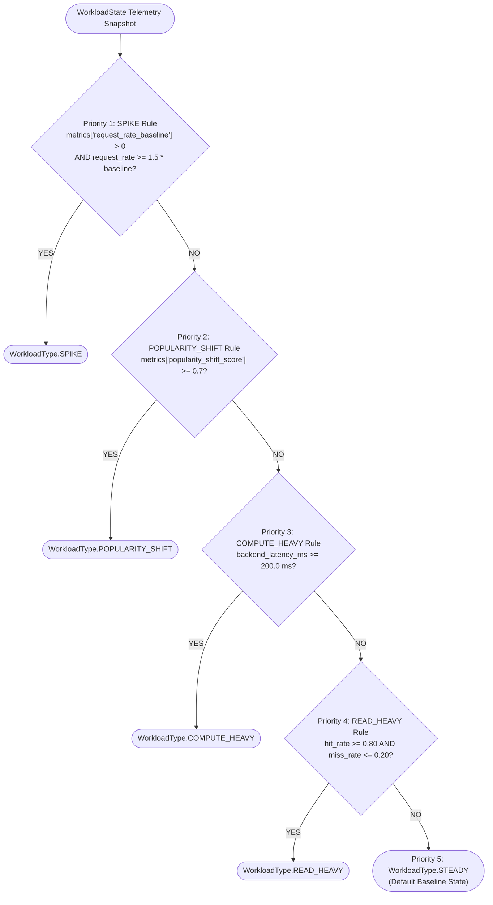

# Adaptive Cache Decision Engine: Complete Mathematical & Architectural Specification

**Document Version:** 1.0.0
**Target Subsystem:** Person 1 — Adaptive Intelligence & Economic Modeling
**Repository Branch:** `feature/adaptive-contracts`
**Execution Boundary:** 100% In-Memory, Pure Python, Deterministic, Stateless (Zero External Service/Infrastructure Dependencies)

---

## 1. Executive Summary & Architectural Flow

The **Adaptive Decision Engine** unifies multi-dimensional feature extraction, real-time workload pattern classification, workload-weighted retention utility scoring, temporal staleness detection, dynamic capacity control, and greedy bounded eviction into a single deterministic decision pipeline.

### End-to-End Pipeline Architecture

```mermaid
graph TD
    subgraph Ingestion["1. Telemetry Ingestion"]
        CacheState["Cache Objects (Mapping[str, CacheObject])"]
        WorkloadInput["WorkloadState Telemetry"]
        SystemInput["SystemState Telemetry"]
    end

    subgraph FeaturePipeline["2. Feature Extraction"]
        FE["FeatureExtractor.extract()"]
        NormFreq["Normalized Frequency [0, 1]"]
        NormRec["Normalized Recency [0, 1]"]
        NormCost["Normalized Retrieval Cost [0, 1]"]
        NormSize["Normalized Size [0, 1]"]
        NormTrend["Popularity Trend [0, 1]"]
        CacheState --> FE
        FE --> NormFreq
        FE --> NormRec
        FE --> NormCost
        FE --> NormSize
        FE --> NormTrend
    end

    subgraph Analysis["3. Workload Analysis"]
        WA["WorkloadAnalyzer.analyze()"]
        WorkloadInput --> WA
        WType{"WorkloadType Classification"}
        WA --> WType
    end

    subgraph Scoring["4. Adaptive Retention Scoring"]
        AS["AdaptiveScorer.score()"]
        NormFreq --> AS
        NormRec --> AS
        NormCost --> AS
        NormSize --> AS
        NormTrend --> AS
        WType -->|Dynamic Weight Vector| AS
        Scores["Retention Scores S_i in [0, 1]"]
        AS --> Scores
    end

    subgraph Refresh["5. Staleness Evaluation"]
        RP["RefreshPolicy.should_refresh()"]
        CacheState --> RP
        WType -->|Staleness Multiplier M(W)| RP
        RefreshKeys["Refresh Candidates (keys)"]
        RP --> RefreshKeys
    end

    subgraph Capacity["6. Logical Capacity Sizing"]
        CC["CapacityController.recommend()"]
        WorkloadInput --> CC
        SystemInput --> CC
        CapAction["CapacityAction (SCALE_UP / SCALE_DOWN / MAINTAIN)"]
        TargetCap["Recommended Capacity Bytes (C_rec)"]
        CC --> CapAction
        CC --> TargetCap
    end

    subgraph Eviction["7. Capacity-Driven Eviction"]
        EP["EvictionPolicy.select_evictions()"]
        Scores --> EP
        CacheState --> EP
        TargetCap --> EP
        EvictKeys["Evicted Candidate Keys"]
        EP --> EvictKeys
    end

    subgraph Formulation["8. Contract Emission"]
        DE["DecisionEngine.decide()"]
        CapAction --> DE
        TargetCap --> DE
        Scores --> DE
        EvictKeys --> DE
        RefreshKeys --> DE
        FinalDecision["Frozen v1 Decision Contract (decision_id, timestamp, scores, evictions, reason)"]
        DE --> FinalDecision
    end
```

---

## 2. Shared Contract Schemas & Field Invariants

All components communicate through immutable or validated Pydantic v2 data models defined in `contracts/schemas/`.

### 2.1 `CacheObject`
Represents an individual cached item stored in memory:

| Field Name | Type | Constraints / Default | Semantic Description |
|---|---|---|---|
| `key` | `str` | $\text{len} \ge 1$, non-empty | Unique cache entry identifier |
| `size_bytes` | `int` | $\ge 0$, non-bool | Payload memory footprint in bytes |
| `access_count` | `int` | $\ge 0$, non-bool | Cumulative lifetime access counter |
| `last_accessed` | `datetime` | Timezone-aware | Timestamp of most recent cache request |
| `retrieval_cost_ms` | `float` | $\ge 0.0$, finite | Backend compute/fetch regeneration expense in ms |
| `hit_count` | `Optional[int]` | $\ge 0$, default `None` | Total cache hits served for this key |
| `miss_count` | `Optional[int]` | $\ge 0$, default `None` | Total cache misses incurred for this key |
| `created_at` | `Optional[datetime]` | Timezone-aware, default `None` | Initial cache insertion timestamp |
| `version` | `str` | `"v1"` | Frozen contract schema version |

### 2.2 `WorkloadState`
Telemetry snapshot aggregated across an observation window:

| Field Name | Type | Constraints / Default | Semantic Description |
|---|---|---|---|
| `request_rate` | `float` | $\ge 0.0$, finite | Total arrival rate in requests per second |
| `hit_rate` | `float` | $[0.0, 1.0]$, finite | Instantaneous cache hit ratio ($\text{hits} / \text{total}$) |
| `miss_rate` | `float` | $[0.0, 1.0]$, finite | Instantaneous cache miss ratio ($\text{misses} / \text{total}$) |
| `backend_latency_ms` | `float` | $\ge 0.0$, finite | Mean backend fetch/compute latency observed |
| `workload_type` | `Optional[WorkloadType]` | Default `None` | Prior or external workload classification |
| `timestamp` | `datetime` | Timezone-aware | Observation snapshot timestamp |
| `window_seconds` | `float` | $> 0.0$, finite | Observation window duration |
| `metrics` | `Optional[Dict[str, Any]]` | Default `None` | Optional workload signals (`request_rate_baseline`, `popularity_shift_score`) |

### 2.3 `SystemState`
Telemetry snapshot of cache memory utilization:

| Field Name | Type | Constraints / Default | Semantic Description |
|---|---|---|---|
| `cache_capacity_bytes` | `int` | $> 0$, non-bool | Current allocated cache capacity in bytes |
| `cache_usage_bytes` | `int` | $\ge 0$, non-bool | Current sum of stored object sizes in bytes |
| `object_count` | `int` | $\ge 0$, non-bool | Current count of distinct objects in cache |
| `backend_calls` | `Optional[int]` | $\ge 0$, default `None` | Cumulative backend fetch requests |
| `cache_evictions` | `Optional[int]` | $\ge 0$, default `None` | Cumulative evicted object count |
| `timestamp` | `datetime` | Timezone-aware | Observation timestamp |
| `window_seconds` | `float` | $> 0.0$, finite | Measurement window duration |

### 2.4 `Decision`
The final, immutable contract emitted by `DecisionEngine`:

| Field Name | Type | Constraints / Default | Semantic Description |
|---|---|---|---|
| `decision_id` | `str` | Prefix `dec-`, SHA-256 hash | Deterministic unique decision identifier |
| `timestamp` | `datetime` | Timezone-aware | Execution timestamp |
| `capacity_action` | `CapacityAction` | Enum | Recommended resizing (`SCALE_UP`, `SCALE_DOWN`, `MAINTAIN`) |
| `recommended_capacity_bytes` | `int` | $> 0$ | Bounded logical capacity target ($C_{\min} \le C_{\text{rec}} \le C_{\max}$) |
| `object_scores` | `Dict[str, float]` | Each score in $[0.0, 1.0]$ | Retention utility scores for all active objects |
| `eviction_keys` | `List[str]` | Distinct string keys | Candidate keys selected for immediate eviction |
| `reason` | `str` | Non-empty | Explainable natural language justification |
| `metadata` | `Optional[Dict[str, Any]]` | Structured telemetry | Extended signals (`refresh_keys`, `workload_type`, counts) |

---

## 3. Feature Extraction Engine (`FeatureExtractor`)

The `FeatureExtractor` transforms raw object metadata and sliding window telemetry into 5 normalized dimensions in the interval $[0.0, 1.0]$.

### 3.1 Clamping and Normalization Primitives

#### Safe Value Clamping
$$\text{clamp}(v, \min, \max) = \max(\min, \min(\max, v))$$

#### Min-Max Normalization with Single-Object / Uniform Fallback
For a sequence of values $V = \{v_1, v_2, \dots, v_n\}$:
$$\text{norm}(v_i) = \begin{cases}
0.5 & \text{if } \max(V) = \min(V) \text{ or } n \le 1 \\
\text{clamp}\left(\frac{v_i - \min(V)}{\max(V) - \min(V)}, 0.0, 1.0\right) & \text{if } \max(V) > \min(V)
\end{cases}$$
*(Note: Floating-point equality is guarded using $\text{rel\_tol}=10^{-9}$ and $\text{abs\_tol}=10^{-12}$.)*

---

### 3.2 The Five Feature Dimensions

```
+---------------------------------------------------------------------------------------------+
| Feature Dimension | Raw Expression                      | Transformation / Normalization    |
+-------------------+-------------------------------------+-----------------------------------+
| 1. Frequency (F)  | obj.access_count / window_seconds   | Min-Max normalized over set V     |
| 2. Recency (R)    | age = now - obj.last_accessed       | clamp(1.0 - (age / window), 0, 1) |
| 3. Cost (C)       | obj.retrieval_cost_ms               | Min-Max normalized over set V     |
| 4. Size (S)       | obj.size_bytes                      | Min-Max normalized over set V     |
| 5. Trend (T)      | Delta = (curr - prev) / max(prev,1) | clamp(0.5 + 0.5 * tanh(Delta),0,1)|
+---------------------------------------------------------------------------------------------+
```

#### Detailed Mathematical Definitions:

1. **Frequency ($F_i$):**
   $$f_i^{\text{raw}} = \frac{\text{obj}_i.\text{access\_count}}{W_{\text{seconds}}}$$
   $$F_i = \text{norm}(f_i^{\text{raw}})$$
   *Captures request arrival intensity per unit time.*

2. **Recency ($R_i$):**
   $$\Delta t_i = \max\left(0.0, (\text{now} - \text{obj}_i.\text{last\_accessed}).\text{total\_seconds}()\right)$$
   $$R_i = \text{clamp}\left(1.0 - \frac{\Delta t_i}{W_{\text{seconds}}}, 0.0, 1.0\right)$$
   *Decays linearly from $1.0$ (instantaneous access) to $0.0$ when the elapsed time exceeds the observation window duration.*

3. **Retrieval Cost ($C_i$):**
   $$c_i^{\text{raw}} = \text{obj}_i.\text{retrieval\_cost\_ms}$$
   $$C_i = \text{norm}(c_i^{\text{raw}})$$
   *Normalizes backend regeneration expense relative to the active object set.*

4. **Size Penalty ($S_i$):**
   $$s_i^{\text{raw}} = \text{float}(\text{obj}_i.\text{size\_bytes})$$
   $$S_i = \text{norm}(s_i^{\text{raw}})$$
   *Measures memory consumption pressure relative to peer objects.*

5. **Popularity Trend ($T_i$):**
   Let $k_i = \text{obj}_i.\text{key}$. If $k_i$ is absent from $\text{previous\_access\_counts}$ (cold start or no prior window):
   $$T_i = 0.5$$
   If $k_i$ exists in previous access records:
   $$\Delta c_i = \frac{\text{current\_count}_i - \text{previous\_count}_i}{\max(\text{previous\_count}_i, 1)}$$
   $$T_i = \text{clamp}\left(0.5 + 0.5 \cdot \tanh(\Delta c_i), 0.0, 1.0\right)$$
   *Behavioral properties:*
   - Unchanged traffic ($\Delta c_i = 0 \implies \tanh(0) = 0$): $T_i = 0.50$ (neutral).
   - Traffic doubles (+100%, $\Delta c_i = 1.0 \implies \tanh(1) \approx 0.7616$): $T_i \approx 0.8808$.
   - Traffic drops to zero (-100%, $\Delta c_i = -1.0 \implies \tanh(-1) \approx -0.7616$): $T_i \approx 0.1192$.
   - Symmetrically bounds infinite surges or collapses into $[0.0, 1.0]$.

---

## 4. Workload Analysis & Pattern Classification (`WorkloadAnalyzer`)

The `WorkloadAnalyzer` is a stateless, deterministic rule engine that classifies observed `WorkloadState` telemetry into one of five frozen `WorkloadType` enum constants.

### 4.1 Prioritized Evaluation Cascade

Rules are evaluated in strict priority order (first match terminates evaluation):



### 4.2 Threshold Constants & Exact Match Logic

| Priority | Pattern Name | Exact Trigger Condition | Selected Parameter Constants |
|---|---|---|---|
| **1** | `SPIKE` | $\text{baseline} > 0 \;\land\; R_{\text{req}} \ge 1.5 \times \text{baseline}$ | `SPIKE_MULTIPLIER = 1.5` |
| **2** | `POPULARITY_SHIFT` | $\text{shift\_score} \ge 0.70$ | `POPULARITY_SHIFT_THRESHOLD = 0.70` |
| **3** | `COMPUTE_HEAVY` | $L_{\text{backend}} \ge 200.0\text{ ms}$ | `COMPUTE_LATENCY_THRESHOLD_MS = 200.0` |
| **4** | `READ_HEAVY` | $H \ge 0.80 \;\land\; M \le 0.20$ | `READ_HEAVY_HIT_RATE = 0.80`, `READ_HEAVY_MISS_RATE = 0.20` |
| **5** | `STEADY` | Default state when no prior rule fires | Baseline normal operating conditions |

#### Defensive Guards:
- Booleans (`True`/`False`), non-numeric values, `None`, or non-positive baseline values in `metrics` are strictly ignored, preventing false positives.

---

## 5. Adaptive Retention Scoring Engine (`AdaptiveScorer`)

The `AdaptiveScorer` calculates a composite retention utility score $\text{Score}_i \in [0.0, 1.0]$ for each cache object. Higher scores indicate higher retention value; lowest-scoring objects are targeted first during eviction.

### 5.1 General Mathematical Scoring Formula

$$\text{Score}_i = \text{clamp}\left(w_f \cdot F_i + w_r \cdot R_i + w_c \cdot C_i + w_t \cdot T_i - w_s \cdot S_i, \; 0.0, \; 1.0\right)$$

Where:
- $F_i$: Normalized Frequency
- $R_i$: Normalized Recency
- $C_i$: Normalized Retrieval Cost
- $T_i$: Normalized Popularity Trend
- $S_i$: Normalized Size Penalty
- $w_f, w_r, w_c, w_t, w_s$: Workload-specific weight parameters.

---

### 5.2 Centralized Weight Matrix by `WorkloadType`

The weight configurations are defined as immutable `MappingProxyType` mappings:

| Workload Pattern | Frequency ($w_f$) | Recency ($w_r$) | Retrieval Cost ($w_c$) | Trend ($w_t$) | Size Penalty ($w_s$) | Positive Weights Sum ($\sum w_k$) |
|---|---|---|---|---|---|---|
| **`STEADY`** | **0.30** | **0.25** | **0.25** | **0.15** | **0.05** | $0.30 + 0.25 + 0.25 + 0.15 = 0.95$ |
| **`READ_HEAVY`** | **0.40** | **0.30** | **0.15** | **0.10** | **0.05** | $0.40 + 0.30 + 0.15 + 0.10 = 0.95$ |
| **`COMPUTE_HEAVY`** | **0.20** | **0.15** | **0.45** | **0.15** | **0.05** | $0.20 + 0.15 + 0.45 + 0.15 = 0.95$ |
| **`SPIKE`** | **0.35** | **0.35** | **0.15** | **0.10** | **0.05** | $0.35 + 0.35 + 0.15 + 0.10 = 0.95$ |
| **`POPULARITY_SHIFT`** | **0.20** | **0.20** | **0.15** | **0.40** | **0.05** | $0.20 + 0.20 + 0.15 + 0.40 = 0.95$ |

### 5.3 Weight Selection Rationale

1. **`STEADY`**: Balanced distribution across Frequency (0.30), Recency (0.25), and Cost (0.25). Captures stable long-term popularity while maintaining cost-awareness.
2. **`READ_HEAVY`**: Frequency (0.40) and Recency (0.30) dominate (70% combined). Maximizes cache hit throughput when backend queries are fast and uniform.
3. **`COMPUTE_HEAVY`**: Cost receives the dominant weight (**0.45**). Strongly protects objects with expensive regeneration latency (e.g., 200 ms recommendations) even if access frequency is moderate.
4. **`SPIKE`**: Frequency (0.35) and Recency (0.35) share equal primacy (70% combined). Allows the cache to rapidly absorb burst traffic on the hot set.
5. **`POPULARITY_SHIFT`**: Trend receives the dominant weight (**0.40**). Overcomes the "LFU cache pollution" trap by immediately promoting emerging hot items ($\Delta > 0$) and depreciating historically popular but abandoned items ($\Delta < 0$).
6. **`Size Penalty` (0.05 across all profiles)**: Provides a mild, constant penalty to penalize oversized objects without overriding high utility.

---

## 6. Cost Model & Economic Valuation (`CostModel`)

The `CostModel` provides pure data-driven economic evaluation comparing the backend cost savings of caching an object versus its RAM memory retention expense.

### 6.1 Parameter Constants and Conversion Factors

```python
BYTES_PER_GB: int = 1_000_000_000                  # Decimal Gigabyte convention
DEFAULT_BACKEND_COST_PER_MS: float = 1.0           # Baseline cost rate per millisecond
DEFAULT_CACHE_RAM_COST_PER_GB_HOUR: float = 0.10   # $0.10 per GB-hour
DEFAULT_HOURS: float = 1.0                         # 1-hour retention accounting period
DEFAULT_ALPHA: float = 1.0                         # Linear size penalty exponent
DEFAULT_IDENTICAL_COST_NORMALIZATION: float = 0.5   # Fallback for uniform cost
```

### 6.2 Economic Formulas

#### 1. Avoided Backend Cost Savings
$$\text{CostSaved} = \text{obj}.\text{retrieval\_cost\_ms} \times N_{\text{cached\_requests}} \times R_{\text{backend\_rate}}$$
*Measures computational resource expense avoided by serving requests from cache.*

#### 2. Cache RAM Retention Cost
$$\text{CostRAM} = \left(\frac{\text{obj}.\text{size\_bytes}}{1\,000\,000\,000}\right) \times R_{\text{RAM\_rate}} \times H$$
*Measures the physical RAM memory footprint cost over retention duration $H$ hours.*

#### 3. Net Economic Benefit
$$\text{Net Benefit} = \text{CostSaved} - \text{CostRAM}$$
- $\text{Net Benefit} > 0$: Retaining the object is economically advantageous.
- $\text{Net Benefit} < 0$: The cost to retain the object in RAM exceeds the backend regeneration savings.

#### 4. Value Density
$$\text{Value Density} = \frac{\text{Score}}{\text{size\_bytes}^{\alpha}}$$
Where $\alpha > 0$ controls the penalty exponent (default $\alpha = 1.0$). Evaluates retention efficiency per unit of memory consumed.

---

## 7. Refresh Policy & Staleness Detection (`RefreshPolicy`)

The `RefreshPolicy` decouples **staleness** (when data needs revalidation) from **capacity eviction** (when RAM needs freeing).

### 7.1 Separation of Concerns

- **Eviction**: Frees RAM capacity by dropping lowest-utility objects when cache usage exceeds capacity bounds.
- **Refresh**: Identifies aging objects whose cached content has grown stale, signaling background revalidation *without necessarily evicting the object*.

### 7.2 Staleness Threshold Formula

$$\theta_{\text{eff}} = \theta_{\text{base}} \times M(W)$$

Where:
- $\theta_{\text{base}}$: Base staleness threshold in seconds (`DEFAULT_REFRESH_AFTER_SECONDS = 300.0`).
- $M(W)$: Workload-adaptive multiplier (`DEFAULT_AGGRESSIVE_MULTIPLIER = 0.5`).

#### Workload Multiplier Function $M(W)$:
$$M(W) = \begin{cases}
0.5 & \text{if } W \in \{\text{SPIKE}, \text{POPULARITY\_SHIFT}\} \\
1.0 & \text{if } W \in \{\text{COMPUTE\_HEAVY}, \text{READ\_HEAVY}, \text{STEADY}, \text{None}\}
\end{cases}$$

#### Evaluation Rule:
$$\text{age} = \max\left(0.0, (\text{now} - \text{obj}.\text{last\_accessed}).\text{total\_seconds}()\right)$$
$$\text{should\_refresh} = (\text{age} \ge \theta_{\text{eff}})$$

*Behavioral impact:*
- Under **SPIKE** and **POPULARITY_SHIFT**, the threshold drops from $300\text{s}$ to $150\text{s}$, aggressively refreshing fast-moving and shifting content.
- Under **COMPUTE_HEAVY**, the threshold remains at $300\text{s}$ to avoid generating expensive background backend queries.

---

## 8. Dynamic Capacity Controller (`CapacityController`)

The `CapacityController` evaluates system memory utilization and request traffic to recommend logical cache capacity adjustments: `SCALE_UP`, `SCALE_DOWN`, or `MAINTAIN`.

### 8.1 Configuration Parameters & Thresholds

```python
SCALE_UP_PERCENTAGE: float = 0.20             # +20% capacity increase
SCALE_DOWN_PERCENTAGE: float = 0.15           # -15% capacity reduction

HIGH_UTILIZATION_THRESHOLD: float = 0.85      # 85% cache memory usage
CRITICAL_UTILIZATION_THRESHOLD: float = 0.90  # 90% cache memory usage
LOW_UTILIZATION_THRESHOLD: float = 0.40       # 40% cache memory usage

HIGH_HIT_RATE_THRESHOLD: float = 0.80         # 80% cache hit throughput
ELEVATED_MISS_RATE_THRESHOLD: float = 0.20    # 20% cache miss rate
```

### 8.2 Decision Logic & Resizing Formulas

Let utilization $U = \frac{\text{system}.\text{cache\_usage\_bytes}}{\text{system}.\text{cache\_capacity\_bytes}}$ and current capacity $C_{\text{curr}} = \text{system}.\text{cache\_capacity\_bytes}$.

#### Rule Evaluation Order:

```
1. IF (U >= 0.85 AND workload.miss_rate > 0.20):
       Action = SCALE_UP
       C_raw  = ceil(C_curr * (1.0 + 0.20)) = ceil(C_curr * 1.20)
       Reason = "High cache utilization combined with elevated miss rate indicates cache pressure."

2. ELSE IF (U >= 0.90):
       Action = SCALE_UP
       C_raw  = ceil(C_curr * (1.0 + 0.20)) = ceil(C_curr * 1.20)
       Reason = "Cache utilization is critically high."

3. ELSE IF (U <= 0.40 AND workload.hit_rate >= 0.80):
       Action = SCALE_DOWN
       C_raw  = floor(C_curr * (1.0 - 0.15)) = floor(C_curr * 0.85)
       Reason = "Cache utilization is low while cache hit rate remains strong."

4. ELSE:
       Action = MAINTAIN
       C_raw  = C_curr
       Reason = "Cache utilization and performance metrics are within normal operating thresholds."
```

#### Capacity Bounding & Clamping
The recommended capacity is strictly clamped within configured administrator bounds:
$$C_{\text{rec}} = \max\left(C_{\min}, \; \min\left(C_{\text{raw}}, \; C_{\max}\right)\right)$$

---

## 9. Eviction Selection Policy (`EvictionPolicy`)

The `EvictionPolicy` handles candidate selection when current cache memory usage exceeds the target capacity.

### 9.1 Capacity Gap Calculation

$$\text{current\_usage} = \sum_{k \in \text{cache}} \text{obj}_k.\text{size\_bytes}$$
$$\text{bytes\_to\_free} = \text{current\_usage} - C_{\text{target}}$$

If $\text{bytes\_to\_free} \le 0$, no eviction is needed and an empty list `[]` is returned.

### 9.2 Deterministic Ranking & Selection Loop

1. **Deterministic Multi-Key Sorting:**
   All candidate object keys are sorted in ascending order of retention utility score, with ascending string key as the deterministic tie-breaker:
   $$\text{sort\_key}(k) = (\text{Score}(k), \; k)$$
   *(Lowest score = highest eviction priority).*

2. **Greedy Freeing Loop:**
   Candidates are selected in sorted order until the cumulative freed bytes meet or exceed $\text{bytes\_to\_free}$:
   $$\text{freed\_bytes} = \sum_{j=1}^{m} \text{obj}_{k_j}.\text{size\_bytes} \ge \text{bytes\_to\_free}$$

---

### 9.3 Comparison: Adaptive Eviction vs. Baseline Policies

| Policy | Ranking Metric | Sort Key / Eviction Order | Primary Strengths | Failure Modes / Weaknesses |
|---|---|---|---|---|
| **`LRU`** | Elapsed time since last access | `(obj.last_accessed, key)` ascending | Adapts well to temporal recency and shifts | Polluted by one-hit wonders; blind to backend cost |
| **`LFU`** | Cumulative access count | `(obj.access_count, key)` ascending | Optimal for static hot subsets | Suffers cache pollution during popularity shifts |
| **`GDS`** | Cost per unit size | `(retrieval_cost_ms / size_bytes, key)` | Retains expensive, small objects | Ignores access frequency and recency |
| **`ADAPTIVE`** | Multi-factor utility score | `(Score, key)` ascending | Dynamically weights frequency, recency, cost, and trend by workload | Requires observation window telemetry |

---

## 10. Complete Decision Engine Pipeline (`DecisionEngine`)

The `DecisionEngine` orchestrates the entire intelligence lifecycle into a single execution step:

```
Input: objects, workload, system, min_capacity, max_capacity, now, previous_access_counts, refresh_after_seconds

Step 1: Validate inputs, capacity bounds, and timezone-aware timestamps.
Step 2: Resolve eval_time = now or system.timestamp.
Step 3: Extract normalized 5D features via FeatureExtractor.
Step 4: Classify active workload pattern via WorkloadAnalyzer.
Step 5: Compute retention scores via AdaptiveScorer(features, detected_workload_type).
Step 6: Identify stale keys via RefreshPolicy.should_refresh(obj, eval_time, detected_workload_type).
Step 7: Compute capacity resizing recommendation via CapacityController.recommend().
Step 8: IF current_usage > recommended_capacity:
            eviction_keys = EvictionPolicy.select_evictions(scores, objects, recommended_capacity)
        ELSE:
            eviction_keys = []
Step 9: Compile structured metadata dictionary (workload_type, refresh_keys, counts, usage).
Step 10: Formulate natural language explainability reason string.
Step 11: Compute deterministic SHA-256 Decision ID.
Step 12: Emit frozen v1 Decision contract.
```

### 10.1 Deterministic Decision ID Generation

To ensure reproducible, trace-verifiable audit logs without random UUIDs:

$$\text{seed} = \text{eval\_time}.\text{isoformat}() + \text{"-"} + W.\text{value} + \text{"-"} + C_{\text{rec}} + \text{"-"} + \text{join}(\text{sorted\_keys})$$
$$\text{decision\_id} = \text{"dec-"} + \text{SHA256}(\text{seed})[0:16]$$

### 10.2 Reason String Format Grammar

The explainability string follows a strict, parseable natural-language grammar:
$$\text{"Workload="} + W.\text{value} + \text{"; "} + E_{\text{desc}} + \text{"; "} + R_{\text{desc}} + \text{"; capacity action="} + A_{\text{cap}}.\text{value} + \text{"."}$$

*Examples:*
- `"Workload=read_heavy; cache pressure requires 2 evictions; 3 objects require refresh; capacity action=scale_up."`
- `"Workload=steady; no evictions required; no objects require refresh; capacity action=maintain."`

---

## 11. Verification Matrix & Empirical Validation

The entire specification described above is fully implemented and validated with **536 passing tests** across `backend/tests`, `benchmark/tests`, and `demo/tests`.

| Component | Primary Source File | Test Verification Suite | Pass Status |
|---|---|---|---|
| Contract Schemas | `contracts/schemas/` | `backend/tests/contracts/` | 100% Passed |
| Feature Extraction | `backend/adaptive/features/extractor.py` | `backend/tests/adaptive/features/` | 100% Passed |
| Workload Analyzer | `backend/adaptive/workload/analyzer.py` | `backend/tests/adaptive/workload/` | 100% Passed |
| Adaptive Scorer | `backend/adaptive/scoring/scorer.py` | `backend/tests/adaptive/scoring/` | 100% Passed |
| Refresh Policy | `backend/adaptive/refresh/policy.py` | `backend/tests/adaptive/refresh/` | 100% Passed |
| Capacity Controller | `backend/adaptive/capacity/controller.py` | `backend/tests/adaptive/capacity/` | 100% Passed |
| Eviction Policy | `backend/adaptive/eviction/policy.py` | `backend/tests/adaptive/eviction/` | 100% Passed |
| Cost Model | `backend/cost/model.py` | `backend/tests/cost/` | 100% Passed |
| Decision Engine | `backend/adaptive/engine/decision_engine.py` | `backend/tests/adaptive/engine/` | 100% Passed |
| Benchmark Engine | `benchmark/` | `benchmark/tests/test_benchmark_engine.py` | 100% Passed (34 tests) |
| CLI Live Demo | `demo/adaptive_demo.py` | `demo/tests/test_adaptive_demo.py` | 100% Passed (9 tests) |
